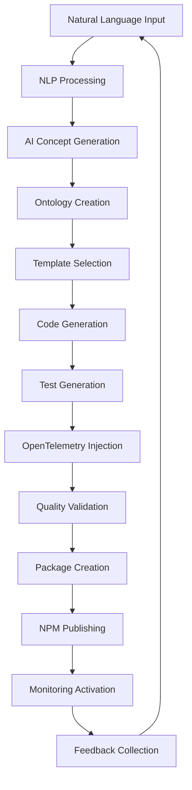

# Autonomous CLI Generation Pipeline Architecture

## Executive Summary

The Autonomous CLI Generation Pipeline is a comprehensive system that transforms natural language ideas into production-ready CLI tools with full observability, automated testing, and NPM publishing capabilities. This architecture leverages AI-driven ideation, semantic ontologies, template-based code generation, and modern DevOps practices to create a fully automated CLI development lifecycle.

## System Overview

```
┌─────────────────────────────────────────────────────────────────────────────────┐
│                     AUTONOMOUS CLI GENERATION PIPELINE                          │
├─────────────────────────────────────────────────────────────────────────────────┤
│  Natural Language Input → AI Ideation → Code Generation → Testing → Publishing  │
└─────────────────────────────────────────────────────────────────────────────────┘

┌─────────────────┐    ┌──────────────────┐    ┌─────────────────┐    ┌─────────────────┐
│  AI Ideation    │───▶│  Weaver Forge    │───▶│  Code Generator │───▶│  Testing &      │
│  Chain          │    │  Integration     │    │  Pipeline       │    │  Validation     │
│                 │    │                  │    │                 │    │                 │
│ • NLP Processing│    │ • Templates      │    │ • Citty CLI     │    │ • Unit Tests    │
│ • Ollama/AI     │    │ • Conventions    │    │ • Ontology      │    │ • Integration   │
│ • Requirements  │    │ • OpenTelemetry  │    │ • Zod Schemas   │    │ • Performance   │
│ • Enhancement   │    │ • Multi-target   │    │ • TypeScript    │    │ • Security      │
└─────────────────┘    └──────────────────┘    └─────────────────┘    └─────────────────┘
         │                       │                       │                       │
         ▼                       ▼                       ▼                       ▼
┌─────────────────┐    ┌──────────────────┐    ┌─────────────────┐    ┌─────────────────┐
│  OpenTelemetry  │    │  NPM Publishing  │    │  Monitoring &   │    │  Feedback Loop  │
│  Integration    │    │  Automation      │    │  Analytics      │    │  & Continuous   │
│                 │    │                  │    │                 │    │  Improvement    │
│ • Auto Tracing  │    │ • Package Gen    │    │ • Usage Stats   │    │ • Error Analysis│
│ • Metrics       │    │ • Version Mgmt   │    │ • Performance   │    │ • Auto Updates  │
│ • Distributed   │    │ • README Auto    │    │ • User Feedback │    │ • ML Insights   │
│ • Custom Spans  │    │ • Publish Flow   │    │ • Health Checks │    │ • Optimization  │
└─────────────────┘    └──────────────────┘    └─────────────────┘    └─────────────────┘
```

## Core Architecture Components

### 1. AI Ideation Chain

The AI Ideation Chain transforms natural language descriptions into structured CLI specifications through a multi-stage AI pipeline.

```typescript
interface IdeationChain {
  // Natural Language Processing
  nlpProcessor: {
    provider: 'ollama' | 'vercel-ai';
    models: string[];
    preprocessing: NLPPreprocessor;
    intentRecognition: IntentClassifier;
  };
  
  // CLI Concept Generation
  conceptGenerator: {
    requirementsExtractor: AIModel;
    featureSuggester: AIModel;
    architectureAdvisor: AIModel;
    domainExpertise: DomainKnowledge[];
  };
  
  // Semantic Analysis
  semanticAnalyzer: {
    argumentExtractor: ArgumentAnalyzer;
    commandStructureGenerator: CommandAnalyzer;
    dependencyResolver: DependencyAnalyzer;
    constraintValidator: ConstraintValidator;
  };
  
  // Documentation Generation
  docGenerator: {
    readmeGenerator: AIModel;
    helpTextGenerator: AIModel;
    exampleGenerator: AIModel;
    apiDocGenerator: AIModel;
  };
}
```

#### Architecture Decision Records (ADRs)

**ADR-001: Multi-Model AI Strategy**
- **Context**: Need robust AI processing with fallback capabilities
- **Decision**: Use Ollama for local processing with Vercel AI as cloud fallback
- **Consequences**: Reduces latency and dependency on external services while maintaining quality
- **Trade-offs**: Increased complexity vs. improved reliability

**ADR-002: Semantic Ontology Integration**
- **Context**: Need structured representation of CLI concepts
- **Decision**: Integrate RDF/Turtle ontologies for semantic command representation
- **Consequences**: Enables better AI understanding and validation
- **Trade-offs**: Added complexity vs. improved semantic consistency

### 2. Weaver Forge Integration

Weaver Forge provides the template engine and semantic convention management for multi-target CLI generation.

```typescript
interface WeaverForgeIntegration {
  // Template System
  templateEngine: {
    framework: 'nunjucks';
    templateRegistry: TemplateRepository;
    customFilters: JinjaFilter[];
    inheritanceChains: TemplateInheritance[];
  };
  
  // Semantic Convention Registry
  conventionRegistry: {
    openTelemetryConventions: SemanticConvention[];
    cliConventions: CLIConvention[];
    frameworkConventions: FrameworkConvention[];
    languageConventions: LanguageConvention[];
  };
  
  // Multi-Language Support
  targetSupport: {
    typescript: TypeScriptGenerator;
    javascript: JavaScriptGenerator;
    python: PythonGenerator;
    rust: RustGenerator;
    go: GoGenerator;
  };
  
  // OpenTelemetry Templates
  observabilityTemplates: {
    tracingInstrumentation: TracingTemplate;
    metricsCollection: MetricsTemplate;
    loggingIntegration: LoggingTemplate;
    customAttributes: AttributeTemplate;
  };
}
```

**ADR-003: Template Engine Selection**
- **Context**: Need flexible, maintainable template system
- **Decision**: Use Nunjucks with custom CLI-specific filters
- **Consequences**: Familiar Jinja2 syntax with JavaScript integration
- **Trade-offs**: Learning curve vs. powerful templating capabilities

### 3. Autonomous Code Generation

The core code generation system that produces production-ready CLI applications.

```typescript
interface CodeGenerationPipeline {
  // Citty Framework Integration
  cittyIntegration: {
    commandDefinitions: CommandDefGenerator;
    argumentParsing: ArgumentParserGenerator;
    subcommandHierarchy: SubcommandGenerator;
    usageDocumentation: UsageGenerator;
  };
  
  // Ontology-Based Structure
  ontologyEngine: {
    turtleParser: OntologyParser;
    commandExtractor: CommandExtractor;
    validationEngine: OntologyValidator;
    codeMapper: OntologyToCodeMapper;
  };
  
  // Schema Validation
  validationLayer: {
    zodSchemaGenerator: ZodGenerator;
    runtimeValidation: RuntimeValidator;
    typeInference: TypeInferenceEngine;
    errorHandling: ErrorGenerator;
  };
  
  // Code Quality
  qualityAssurance: {
    linting: ESLintIntegration;
    formatting: PrettierIntegration;
    typeChecking: TypeScriptChecker;
    security: SecurityScanner;
  };
}
```

**ADR-004: Ontology-First Approach**
- **Context**: Need consistent, validatable CLI structure
- **Decision**: Use RDF ontologies as single source of truth
- **Consequences**: Enables advanced validation and cross-target generation
- **Trade-offs**: Initial complexity vs. long-term consistency

### 4. OpenTelemetry Integration

Comprehensive observability integration with automatic instrumentation generation.

```typescript
interface OpenTelemetryIntegration {
  // Automatic Tracing
  tracingSystem: {
    instrumentationInjector: InstrumentationGenerator;
    spanGenerator: SpanGenerator;
    contextPropagation: ContextManager;
    samplingStrategies: SamplingConfiguration;
  };
  
  // Metrics Collection
  metricsSystem: {
    counterGeneration: CounterGenerator;
    histogramGeneration: HistogramGenerator;
    gaugeGeneration: GaugeGenerator;
    customMetrics: CustomMetricGenerator;
  };
  
  // Distributed Tracing
  distributedTracing: {
    traceIdGeneration: TraceIdGenerator;
    parentSpanTracking: ParentSpanManager;
    baggage: BaggageManager;
    crossServiceTracing: CrossServiceTracer;
  };
  
  // Semantic Conventions
  semanticConventions: {
    cliAttributes: CLIAttributeGenerator;
    systemAttributes: SystemAttributeGenerator;
    errorAttributes: ErrorAttributeGenerator;
    performanceAttributes: PerformanceAttributeGenerator;
  };
}
```

**ADR-005: OpenTelemetry by Default**
- **Context**: Need comprehensive observability from day one
- **Decision**: Auto-inject OpenTelemetry instrumentation in all generated CLIs
- **Consequences**: Enhanced debugging, monitoring, and optimization capabilities
- **Trade-offs**: Slight performance overhead vs. operational insights

### 5. Testing & Validation Pipeline

Comprehensive automated testing with multiple validation layers.

```typescript
interface TestingPipeline {
  // Unit Testing
  unitTesting: {
    testGenerator: VitestGenerator;
    mockGenerator: MockGenerator;
    coverageAnalysis: CoverageAnalyzer;
    assertionLibrary: AssertionGenerator;
  };
  
  // Integration Testing
  integrationTesting: {
    cliTestRunner: CLITestRunner;
    environmentSetup: TestEnvironmentManager;
    dataSeeding: TestDataManager;
    cleanupProcedures: CleanupManager;
  };
  
  // Performance Testing
  performanceTesting: {
    benchmarkGenerator: BenchmarkGenerator;
    loadTesting: LoadTestGenerator;
    memoryProfiling: MemoryProfiler;
    cpuProfiling: CPUProfiler;
  };
  
  // Security Testing
  securityTesting: {
    vulnerabilityScanner: VulnerabilityScanner;
    dependencyAuditor: DependencyAuditor;
    secretsScanner: SecretsScanner;
    permissionValidator: PermissionValidator;
  };
}
```

### 6. NPM Publishing Automation

Fully automated package publishing with version management and documentation generation.

```typescript
interface PublishingPipeline {
  // Package Management
  packageManagement: {
    packageJsonGenerator: PackageJsonGenerator;
    versionManager: SemanticVersioner;
    dependencyResolver: DependencyResolver;
    licenseManager: LicenseManager;
  };
  
  // Documentation Automation
  documentationAutomation: {
    readmeGenerator: ReadmeGenerator;
    changelogGenerator: ChangelogGenerator;
    apiDocGenerator: APIDocGenerator;
    exampleGenerator: ExampleGenerator;
  };
  
  // Publishing Workflow
  publishingWorkflow: {
    buildPipeline: BuildOrchestrator;
    testValidation: TestValidator;
    npmAuthentication: NPMAuthManager;
    publishRunner: PublishExecutor;
  };
  
  // Release Management
  releaseManagement: {
    tagCreation: GitTagManager;
    releaseNotes: ReleaseNotesGenerator;
    distributionManager: DistributionManager;
    registrySync: RegistrySync;
  };
}
```

### 7. Monitoring & Feedback Loop

Continuous monitoring and improvement system with ML-driven insights.

```typescript
interface MonitoringSystem {
  // Usage Analytics
  analyticsCollection: {
    usageTracker: UsageAnalyzer;
    performanceCollector: PerformanceCollector;
    errorTracker: ErrorTracker;
    featureUsage: FeatureAnalyzer;
  };
  
  // Feedback Processing
  feedbackSystem: {
    userFeedbackCollector: FeedbackCollector;
    sentimentAnalysis: SentimentAnalyzer;
    issueTracker: IssueTracker;
    improvementSuggester: ImprovementEngine;
  };
  
  // ML-Driven Insights
  mlInsights: {
    patternRecognition: PatternAnalyzer;
    anomalyDetection: AnomalyDetector;
    performancePredictor: PerformancePredictor;
    usageOptimizer: UsageOptimizer;
  };
  
  // Continuous Improvement
  continuousImprovement: {
    autoUpdater: AutoUpdateSystem;
    templateOptimizer: TemplateOptimizer;
    aiModelTrainer: ModelTrainer;
    qualityMetrics: QualityMetricsCollector;
  };
}
```

## Data Flow Architecture

### Primary Data Flow



### Integration Data Flow

```
┌─────────────────┐    ┌──────────────────┐    ┌─────────────────┐
│  Semantic       │───▶│  Template Engine │───▶│  Code Generator │
│  Ontology       │    │                  │    │                 │
│                 │    │ • Nunjucks       │    │ • TypeScript    │
│ • RDF/Turtle    │    │ • Custom Filters │    │ • Citty CLI     │
│ • Command Defs  │    │ • Inheritance    │    │ • Zod Schemas   │
│ • Arguments     │    │ • Composition    │    │ • Tests         │
│ • Validation    │    │                  │    │                 │
└─────────────────┘    └──────────────────┘    └─────────────────┘
         │                       │                       │
         ▼                       ▼                       ▼
┌─────────────────┐    ┌──────────────────┐    ┌─────────────────┐
│  OpenTelemetry  │    │  Quality Gates   │    │  Publishing     │
│  Instrumentation│    │                  │    │  Pipeline       │
│                 │    │ • Linting        │    │                 │
│ • Auto Tracing  │    │ • Testing        │    │ • Versioning    │
│ • Metrics       │    │ • Security       │    │ • Documentation │
│ • Logging       │    │ • Performance    │    │ • NPM Publish   │
│ • Conventions   │    │ • Compliance     │    │ • Distribution  │
└─────────────────┘    └──────────────────┘    └─────────────────┘
```

## Quality Attributes

### Performance Requirements

- **Latency**: Code generation < 30 seconds for complex CLIs
- **Throughput**: 100+ CLI generations per hour
- **Scalability**: Horizontal scaling to 1000+ concurrent requests
- **Memory**: < 2GB RAM per generation instance

### Reliability Requirements

- **Availability**: 99.9% uptime for generation service
- **Error Recovery**: Automatic retry with exponential backoff
- **Fault Tolerance**: Graceful degradation when AI services unavailable
- **Data Integrity**: Atomic operations with rollback capabilities

### Security Requirements

- **Authentication**: JWT-based API authentication
- **Authorization**: Role-based access control
- **Data Protection**: Encryption at rest and in transit
- **Audit Trail**: Complete audit logging for all operations

### Maintainability Requirements

- **Modularity**: Microservices architecture with clear boundaries
- **Testability**: > 90% test coverage requirement
- **Documentation**: Auto-generated API documentation
- **Observability**: Comprehensive metrics and tracing

## Technology Stack Decisions

### Core Technologies

| Component | Technology | Rationale |
|-----------|------------|-----------|
| AI Processing | Ollama + Vercel AI | Local processing with cloud fallback |
| Template Engine | Nunjucks | Familiar syntax with TypeScript integration |
| CLI Framework | Citty | Modern, type-safe CLI building |
| Schema Validation | Zod | Runtime type validation |
| Testing | Vitest | Fast, modern testing framework |
| Observability | OpenTelemetry | Industry standard observability |
| Package Manager | pnpm | Fast, efficient dependency management |

### Infrastructure Technologies

| Component | Technology | Rationale |
|-----------|------------|-----------|
| Container Platform | Docker + Kubernetes | Scalable, cloud-native deployment |
| Message Queue | Redis Streams | High-performance event streaming |
| Database | PostgreSQL + Redis | Reliability + performance |
| API Gateway | Kong | Advanced routing and security |
| CI/CD | GitHub Actions | Integrated with source control |
| Monitoring | Prometheus + Grafana | Open source observability stack |

## Deployment Architecture

### Microservices Architecture

```
┌─────────────────────────────────────────────────────────────────────────────────┐
│                              API Gateway (Kong)                                │
├─────────────────────────────────────────────────────────────────────────────────┤
│                              Load Balancer                                     │
└─────────────────────────────────────────────────────────────────────────────────┘
                                      │
            ┌─────────────────────────┼─────────────────────────┐
            │                         │                         │
            ▼                         ▼                         ▼
    ┌───────────────┐         ┌───────────────┐         ┌───────────────┐
    │  AI Ideation  │         │  Code Gen     │         │  Publishing   │
    │  Service      │         │  Service      │         │  Service      │
    │               │         │               │         │               │
    │ • NLP         │         │ • Templates   │         │ • NPM         │
    │ • Concept     │         │ • Generation  │         │ • Versioning  │
    │ • Validation  │         │ • Testing     │         │ • Docs        │
    └───────────────┘         └───────────────┘         └───────────────┘
            │                         │                         │
            ▼                         ▼                         ▼
    ┌───────────────┐         ┌───────────────┐         ┌───────────────┐
    │  Template     │         │  Quality      │         │  Monitoring   │
    │  Service      │         │  Service      │         │  Service      │
    │               │         │               │         │               │
    │ • Weaver      │         │ • Testing     │         │ • Analytics   │
    │ • Conventions │         │ • Security    │         │ • Feedback    │
    │ • Multi-Lang  │         │ • Validation  │         │ • ML Insights │
    └───────────────┘         └───────────────┘         └───────────────┘
```

### Data Architecture

```
┌─────────────────────────────────────────────────────────────────────────────────┐
│                              Data Layer                                        │
├─────────────────────────────────────────────────────────────────────────────────┤
│                                                                                 │
│  ┌─────────────────┐    ┌──────────────────┐    ┌─────────────────┐           │
│  │  PostgreSQL     │    │  Redis Cache     │    │  File Storage   │           │
│  │                 │    │                  │    │                 │           │
│  │ • User Data     │    │ • Sessions       │    │ • Templates     │           │
│  │ • Generation    │    │ • AI Results     │    │ • Generated     │           │
│  │ • Analytics     │    │ • Queue Data     │    │ • Artifacts     │           │
│  │ • Audit Logs    │    │ • Metrics        │    │ • Documentation │           │
│  └─────────────────┘    └──────────────────┘    └─────────────────┘           │
│                                                                                 │
│  ┌─────────────────┐    ┌──────────────────┐    ┌─────────────────┐           │
│  │  Vector DB      │    │  Time Series DB  │    │  Graph DB       │           │
│  │                 │    │                  │    │                 │           │
│  │ • Embeddings    │    │ • Metrics        │    │ • Dependencies  │           │
│  │ • Similarity    │    │ • Performance    │    │ • Relationships │           │
│  │ • Search        │    │ • Usage Stats    │    │ • Ontologies    │           │
│  └─────────────────┘    └──────────────────┘    └─────────────────┘           │
└─────────────────────────────────────────────────────────────────────────────────┘
```

## Implementation Roadmap

### Phase 1: Foundation (Months 1-2)
- Core AI ideation chain implementation
- Basic template engine integration
- Citty framework integration
- Unit testing framework

### Phase 2: Generation Pipeline (Months 3-4)
- Complete code generation pipeline
- Ontology-based structure generation
- Basic OpenTelemetry integration
- Quality validation gates

### Phase 3: Publishing & Monitoring (Months 5-6)
- NPM publishing automation
- Comprehensive monitoring system
- Basic feedback loop implementation
- Security scanning integration

### Phase 4: Advanced Features (Months 7-8)
- ML-driven insights implementation
- Advanced OpenTelemetry features
- Multi-language target support
- Performance optimization

### Phase 5: Production & Scale (Months 9-10)
- Production deployment
- Load testing and optimization
- Advanced security features
- Enterprise features

## Risk Assessment & Mitigation

### Technical Risks

| Risk | Probability | Impact | Mitigation |
|------|-------------|---------|------------|
| AI Model Reliability | Medium | High | Multi-model fallback strategy |
| Performance Bottlenecks | Medium | Medium | Horizontal scaling, caching |
| Security Vulnerabilities | Low | High | Security scanning, audit trail |
| Template Complexity | High | Medium | Modular template design |

### Business Risks

| Risk | Probability | Impact | Mitigation |
|------|-------------|---------|------------|
| Market Acceptance | Medium | High | MVP validation, user feedback |
| Competition | High | Medium | Differentiation through AI quality |
| Resource Constraints | Medium | Medium | Phased implementation approach |
| Technology Changes | Medium | Low | Modular architecture for adaptability |

## Success Metrics

### Technical Metrics
- Code generation success rate: > 95%
- Generated CLI quality score: > 8/10
- Test coverage: > 90%
- Performance: < 30s generation time

### Business Metrics
- User adoption rate
- CLI deployment success rate
- User satisfaction score
- Revenue per generated CLI

### Operational Metrics
- System uptime: > 99.9%
- Error rate: < 1%
- Support ticket volume
- Resource utilization efficiency

## Conclusion

This autonomous CLI generation pipeline represents a comprehensive approach to transforming natural language ideas into production-ready CLI tools. The architecture balances innovation with proven technologies, ensuring scalability, reliability, and maintainability while delivering exceptional user experience through AI-driven automation and comprehensive observability.

The modular design enables incremental implementation and continuous improvement, while the feedback loop ensures the system evolves to meet user needs and maintains high quality standards. The integration of OpenTelemetry from the ground up provides unprecedented visibility into generated CLI performance and usage patterns, enabling data-driven optimization and enhancement.