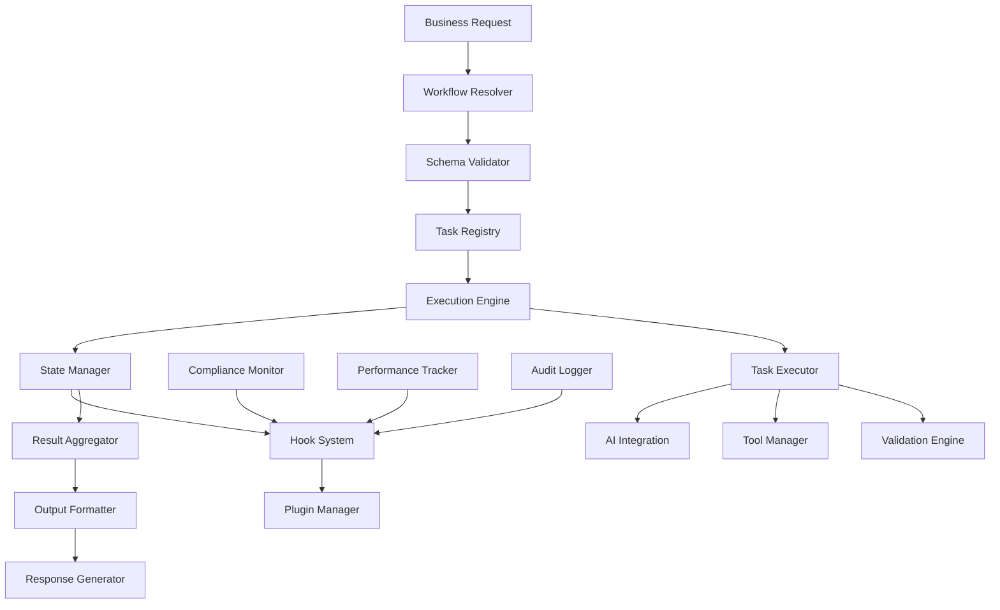
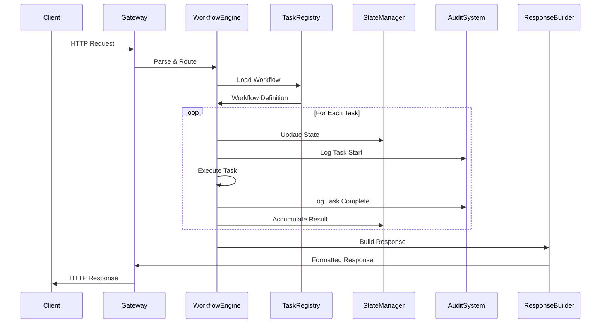
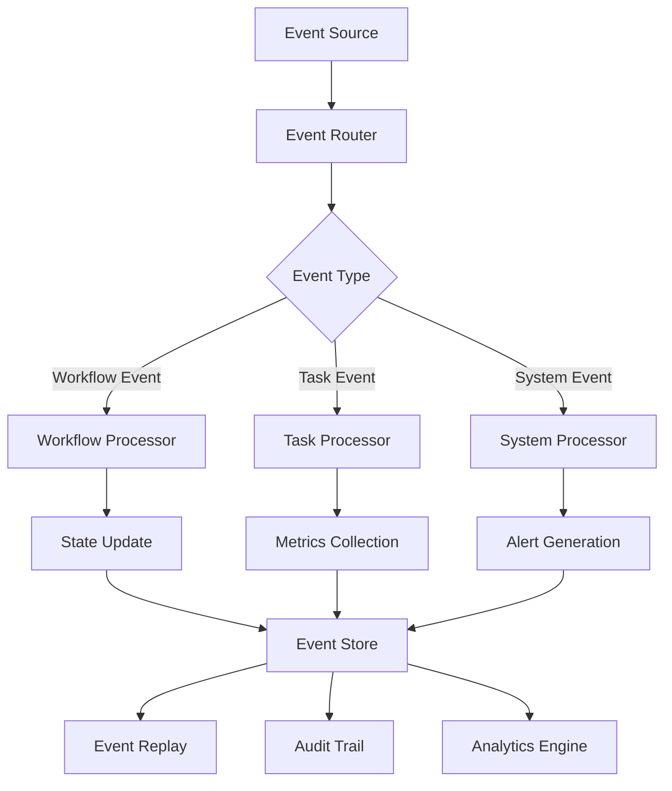
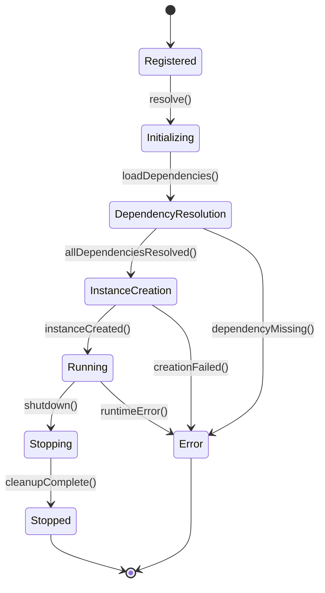

# Component Interactions & Data Flow

## System Component Map

The HIVE QUEEN BDD architecture consists of interconnected components that work together to provide enterprise-grade workflow orchestration and testing capabilities.

## Core Component Interactions

### 1. Citty Pro Framework Core Interactions

```typescript
// Core framework interactions
const frameworkInteractions = {
  // Hook system coordinates all framework events
  hooks: {
    'cli:boot': ['context-loader', 'plugin-manager', 'config-validator'],
    'task:will:call': ['audit-logger', 'performance-monitor', 'compliance-checker'],
    'task:did:call': ['result-validator', 'metrics-collector', 'state-accumulator'],
    'workflow:compile': ['schema-validator', 'dependency-resolver', 'optimization-engine'],
    'output:will:emit': ['format-transformer', 'security-scanner', 'audit-finalizer']
  },
  
  // Plugin system extends core functionality
  plugins: {
    'telemetry': ['metrics-collection', 'performance-tracking', 'alert-generation'],
    'audit': ['compliance-logging', 'security-monitoring', 'regulatory-reporting'],
    'cache': ['state-persistence', 'performance-optimization', 'memory-management']
  }
};
```

### 2. Workflow Engine Component Flow



## Inter-Component Communication Patterns

### 1. Event-Driven Architecture
```typescript
// Event bus for loose coupling
class ComponentEventBus {
  private subscribers = new Map<string, Function[]>();
  
  // Components register for events they care about
  subscribe(event: string, handler: Function) {
    if (!this.subscribers.has(event)) {
      this.subscribers.set(event, []);
    }
    this.subscribers.get(event)!.push(handler);
  }
  
  // Components emit events when state changes
  emit(event: string, data: any) {
    const handlers = this.subscribers.get(event) || [];
    handlers.forEach(handler => handler(data));
  }
}

// Example component interactions
const eventFlow = {
  'workflow:started': [
    'audit-logger.logWorkflowStart',
    'performance-monitor.startTracking',
    'compliance-checker.validateContext'
  ],
  'task:completed': [
    'state-manager.updateState',
    'metrics-collector.recordMetrics',
    'result-validator.validateOutput'
  ],
  'error:occurred': [
    'error-handler.processError',
    'alert-system.triggerAlert',
    'recovery-system.attemptRecovery'
  ]
};
```

### 2. Plugin Architecture Communication
```typescript
// Plugin lifecycle and interaction
interface PluginInteraction {
  initialize(hooks: HookManager, context: RunCtx): Promise<void>;
  beforeTask(taskId: string, input: any): Promise<any>;
  afterTask(taskId: string, result: any): Promise<any>;
  onError(error: Error, context: any): Promise<any>;
  cleanup(): Promise<void>;
}

// Multi-plugin coordination example
const pluginOrchestration = {
  // Sequential plugin execution
  sequential: async (plugins: PluginInteraction[], context: any) => {
    for (const plugin of plugins) {
      await plugin.beforeTask(context.taskId, context.input);
    }
  },
  
  // Parallel plugin execution
  parallel: async (plugins: PluginInteraction[], context: any) => {
    await Promise.all(
      plugins.map(plugin => plugin.beforeTask(context.taskId, context.input))
    );
  }
};
```

### 3. Schema and Validation Flow
```typescript
// Schema-driven component interaction
class SchemaValidationFlow {
  constructor(
    private schemaRegistry: SchemaRegistry,
    private validationEngine: ValidationEngine,
    private errorHandler: ErrorHandler
  ) {}
  
  async validateRequest(request: any, schemaId: string) {
    // 1. Schema resolution
    const schema = await this.schemaRegistry.resolve(schemaId);
    
    // 2. Validation execution
    const result = await this.validationEngine.validate(request, schema);
    
    // 3. Error handling
    if (!result.success) {
      return this.errorHandler.handleValidationError(result.errors);
    }
    
    // 4. Success path
    return result.data;
  }
}
```

## Data Flow Patterns

### 1. Request-Response Flow


### 2. Event Stream Processing


### 3. State Management Flow
```typescript
// Centralized state management with component isolation
class GlobalStateManager {
  private componentStates = new Map<string, any>();
  private stateSubscribers = new Map<string, Function[]>();
  
  // Components register their state requirements
  registerComponent(componentId: string, initialState: any) {
    this.componentStates.set(componentId, initialState);
    this.stateSubscribers.set(componentId, []);
  }
  
  // State updates trigger component notifications
  updateState(componentId: string, updates: Partial<any>) {
    const currentState = this.componentStates.get(componentId);
    const newState = { ...currentState, ...updates };
    this.componentStates.set(componentId, newState);
    
    // Notify subscribers
    const subscribers = this.stateSubscribers.get(componentId) || [];
    subscribers.forEach(callback => callback(newState));
  }
  
  // Cross-component state coordination
  coordinateStateChange(changes: Array<{componentId: string, updates: any}>) {
    const transaction = this.beginTransaction();
    
    try {
      changes.forEach(({componentId, updates}) => {
        this.updateState(componentId, updates);
      });
      transaction.commit();
    } catch (error) {
      transaction.rollback();
      throw error;
    }
  }
}
```

## Component Dependency Graph

### 1. Dependency Resolution
```typescript
// Component dependency management
interface ComponentDependency {
  id: string;
  dependencies: string[];
  provides: string[];
  lifecycle: 'singleton' | 'transient' | 'scoped';
}

class DependencyResolver {
  private components = new Map<string, ComponentDependency>();
  private instances = new Map<string, any>();
  
  register(dependency: ComponentDependency) {
    this.components.set(dependency.id, dependency);
  }
  
  resolve<T>(componentId: string): T {
    const dependency = this.components.get(componentId);
    if (!dependency) throw new Error(`Component ${componentId} not found`);
    
    // Resolve dependencies first
    const resolvedDeps = dependency.dependencies.map(depId => 
      this.resolve(depId)
    );
    
    // Create or retrieve instance
    return this.getInstance(dependency, resolvedDeps);
  }
  
  private getInstance<T>(dependency: ComponentDependency, deps: any[]): T {
    if (dependency.lifecycle === 'singleton' && this.instances.has(dependency.id)) {
      return this.instances.get(dependency.id);
    }
    
    const instance = this.createInstance(dependency, deps);
    
    if (dependency.lifecycle === 'singleton') {
      this.instances.set(dependency.id, instance);
    }
    
    return instance;
  }
}
```

### 2. Component Lifecycle Management


## Integration Patterns

### 1. Service Mesh Integration
```typescript
// Service mesh component communication
class ServiceMeshIntegration {
  constructor(
    private meshRegistry: ServiceRegistry,
    private loadBalancer: LoadBalancer,
    private circuitBreaker: CircuitBreaker
  ) {}
  
  async callService<T>(serviceId: string, operation: string, data: any): Promise<T> {
    // 1. Service discovery
    const serviceInstance = await this.meshRegistry.discover(serviceId);
    
    // 2. Load balancing
    const endpoint = await this.loadBalancer.selectEndpoint(serviceInstance);
    
    // 3. Circuit breaker protection
    return this.circuitBreaker.execute(async () => {
      return this.makeServiceCall(endpoint, operation, data);
    });
  }
  
  private async makeServiceCall(endpoint: ServiceEndpoint, operation: string, data: any) {
    // Service-to-service communication with retries, timeouts, and observability
    return fetch(`${endpoint.url}/${operation}`, {
      method: 'POST',
      headers: {
        'Content-Type': 'application/json',
        'Authorization': `Bearer ${endpoint.token}`,
        'X-Trace-Id': this.generateTraceId()
      },
      body: JSON.stringify(data)
    });
  }
}
```

### 2. Event Sourcing Integration
```typescript
// Event sourcing for component state management
class EventSourcedComponent {
  private events: Event[] = [];
  private currentState: any = {};
  private eventHandlers = new Map<string, Function>();
  
  // Register event handlers
  on(eventType: string, handler: (event: Event) => void) {
    this.eventHandlers.set(eventType, handler);
  }
  
  // Apply event to component state
  apply(event: Event) {
    this.events.push(event);
    const handler = this.eventHandlers.get(event.type);
    if (handler) {
      this.currentState = handler(event);
    }
  }
  
  // Replay events to rebuild state
  replayEvents(events: Event[]) {
    this.events = [];
    this.currentState = {};
    events.forEach(event => this.apply(event));
  }
  
  // Get current component state
  getState() {
    return { ...this.currentState };
  }
  
  // Get event history
  getEvents() {
    return [...this.events];
  }
}
```

### 3. CQRS (Command Query Responsibility Segregation)
```typescript
// Separate read and write operations
class CQRSComponentManager {
  constructor(
    private commandHandler: CommandHandler,
    private queryHandler: QueryHandler,
    private eventStore: EventStore
  ) {}
  
  // Handle commands (writes)
  async executeCommand(command: Command) {
    const events = await this.commandHandler.handle(command);
    await this.eventStore.append(events);
    return events;
  }
  
  // Handle queries (reads)
  async executeQuery(query: Query) {
    return this.queryHandler.handle(query);
  }
  
  // Component projections for read models
  async rebuildProjection(projectionId: string) {
    const events = await this.eventStore.getEvents();
    const projection = this.createProjection(projectionId);
    
    events.forEach(event => projection.apply(event));
    return projection.getState();
  }
}
```

## Error Handling and Recovery

### 1. Component Error Propagation
```typescript
// Error handling across component boundaries
class ComponentErrorHandler {
  private errorStrategies = new Map<string, ErrorStrategy>();
  
  registerStrategy(componentId: string, strategy: ErrorStrategy) {
    this.errorStrategies.set(componentId, strategy);
  }
  
  async handleError(error: ComponentError): Promise<ErrorResult> {
    const strategy = this.errorStrategies.get(error.componentId);
    if (!strategy) {
      return this.defaultErrorHandling(error);
    }
    
    switch (strategy.type) {
      case 'retry':
        return this.retryWithBackoff(error, strategy.config);
      case 'circuit-breaker':
        return this.circuitBreakerHandling(error, strategy.config);
      case 'fallback':
        return this.fallbackHandling(error, strategy.config);
      case 'escalate':
        return this.escalateError(error, strategy.config);
      default:
        return this.defaultErrorHandling(error);
    }
  }
}
```

### 2. Component Health Monitoring
```typescript
// Health check system for component monitoring
class ComponentHealthMonitor {
  private healthChecks = new Map<string, HealthCheck>();
  private healthStatus = new Map<string, ComponentHealth>();
  
  registerHealthCheck(componentId: string, healthCheck: HealthCheck) {
    this.healthChecks.set(componentId, healthCheck);
  }
  
  async checkAllComponents(): Promise<SystemHealth> {
    const healthPromises = Array.from(this.healthChecks.entries()).map(
      async ([componentId, healthCheck]) => {
        const health = await this.checkComponentHealth(componentId, healthCheck);
        this.healthStatus.set(componentId, health);
        return { componentId, health };
      }
    );
    
    const results = await Promise.allSettled(healthPromises);
    return this.aggregateHealthStatus(results);
  }
  
  private async checkComponentHealth(
    componentId: string, 
    healthCheck: HealthCheck
  ): Promise<ComponentHealth> {
    try {
      const result = await Promise.race([
        healthCheck.check(),
        this.timeoutPromise(healthCheck.timeout || 5000)
      ]);
      
      return {
        status: result.healthy ? 'healthy' : 'unhealthy',
        lastCheck: new Date(),
        details: result.details
      };
    } catch (error) {
      return {
        status: 'error',
        lastCheck: new Date(),
        error: error.message
      };
    }
  }
}
```

## Performance Optimization

### 1. Component Caching Strategy
```typescript
// Multi-level caching for component optimization
class ComponentCacheManager {
  private l1Cache = new Map<string, any>(); // In-memory cache
  private l2Cache: RedisCache; // Distributed cache
  private l3Cache: DatabaseCache; // Persistent cache
  
  async get<T>(key: string): Promise<T | null> {
    // L1 Cache check
    if (this.l1Cache.has(key)) {
      return this.l1Cache.get(key);
    }
    
    // L2 Cache check
    const l2Value = await this.l2Cache.get(key);
    if (l2Value) {
      this.l1Cache.set(key, l2Value);
      return l2Value;
    }
    
    // L3 Cache check
    const l3Value = await this.l3Cache.get(key);
    if (l3Value) {
      await this.l2Cache.set(key, l3Value);
      this.l1Cache.set(key, l3Value);
      return l3Value;
    }
    
    return null;
  }
  
  async set<T>(key: string, value: T, ttl?: number): Promise<void> {
    // Write to all cache levels
    this.l1Cache.set(key, value);
    await this.l2Cache.set(key, value, ttl);
    await this.l3Cache.set(key, value, ttl);
  }
}
```

This comprehensive component interaction model ensures that the HIVE QUEEN BDD architecture maintains high performance, reliability, and scalability while providing clear separation of concerns and robust error handling across all system components.