# HIVE QUEEN BDD Data Flow & System Diagrams

## System Architecture Visualization

### High-Level System Overview
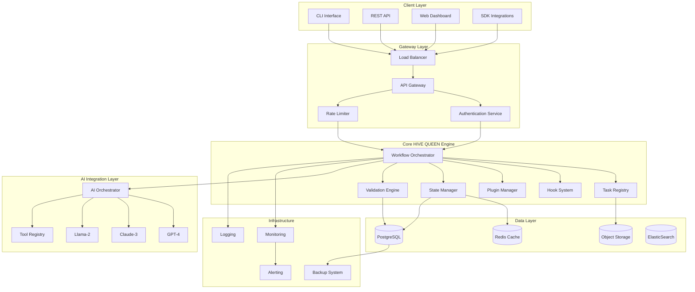

### Detailed Component Architecture
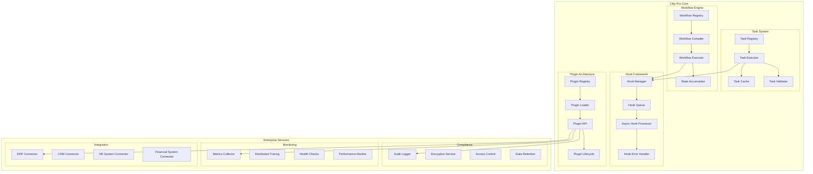

## Workflow Execution Data Flow

### Standard Workflow Execution
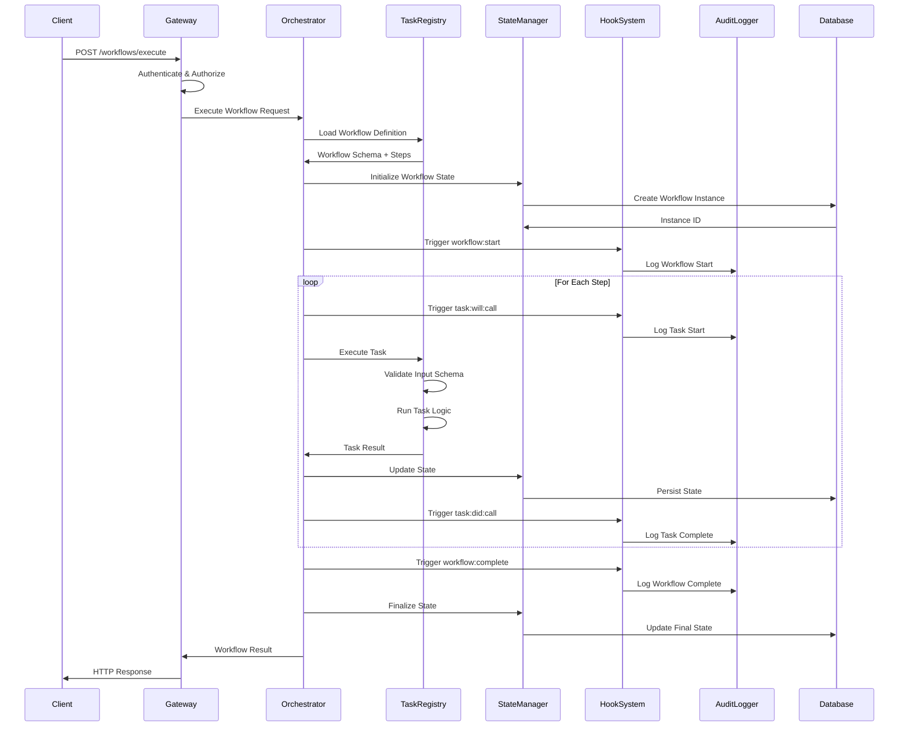

### Error Handling Flow
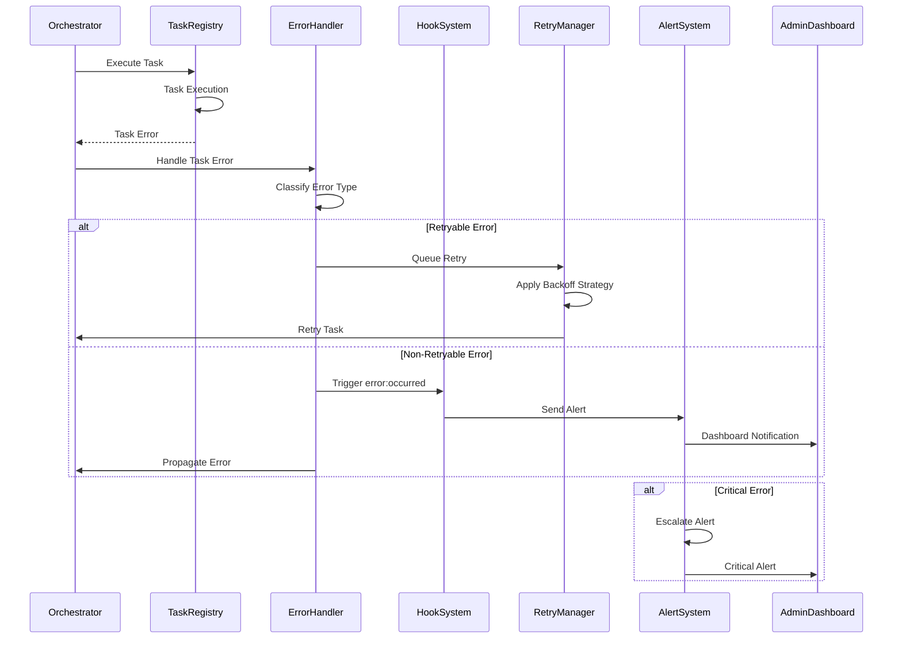

## Multi-Tenant Data Flow

### Tenant Isolation Architecture
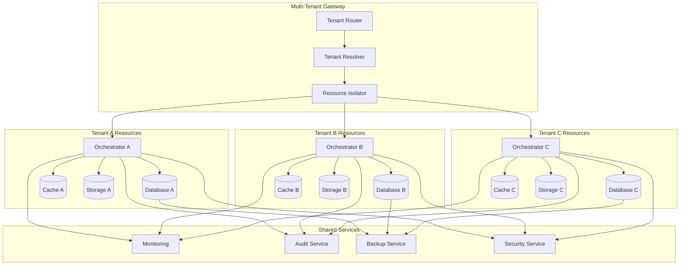

### Tenant Request Flow
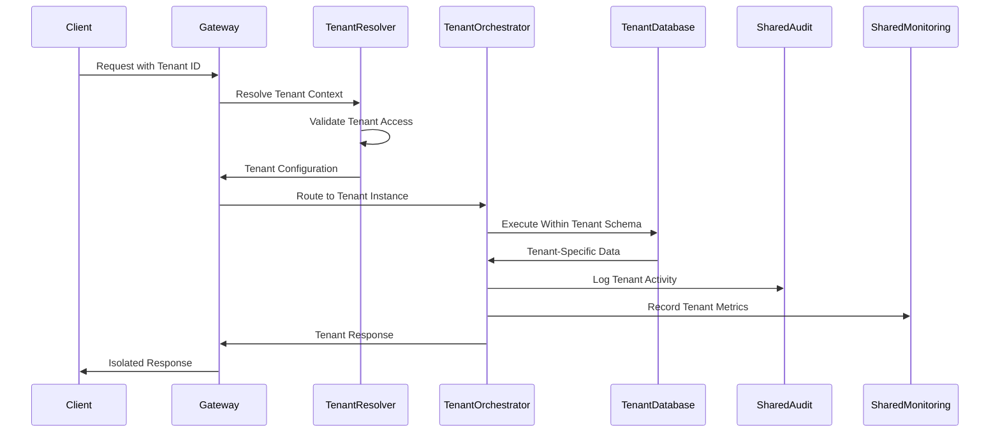

## AI Integration Data Flow

### AI-Powered Workflow Execution
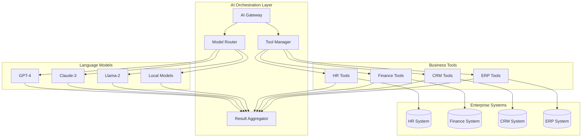

### AI Tool Execution Sequence
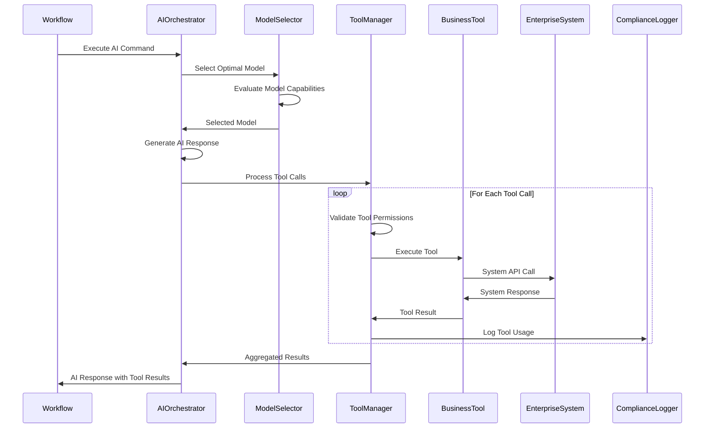

## Performance Optimization Flow

### Caching Strategy Architecture
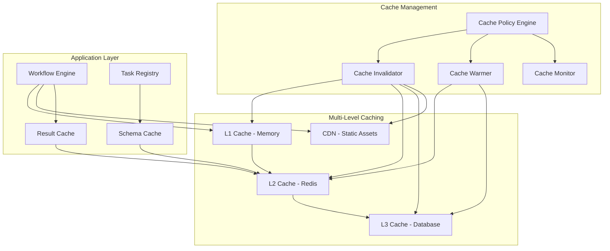

### Load Balancing and Scaling
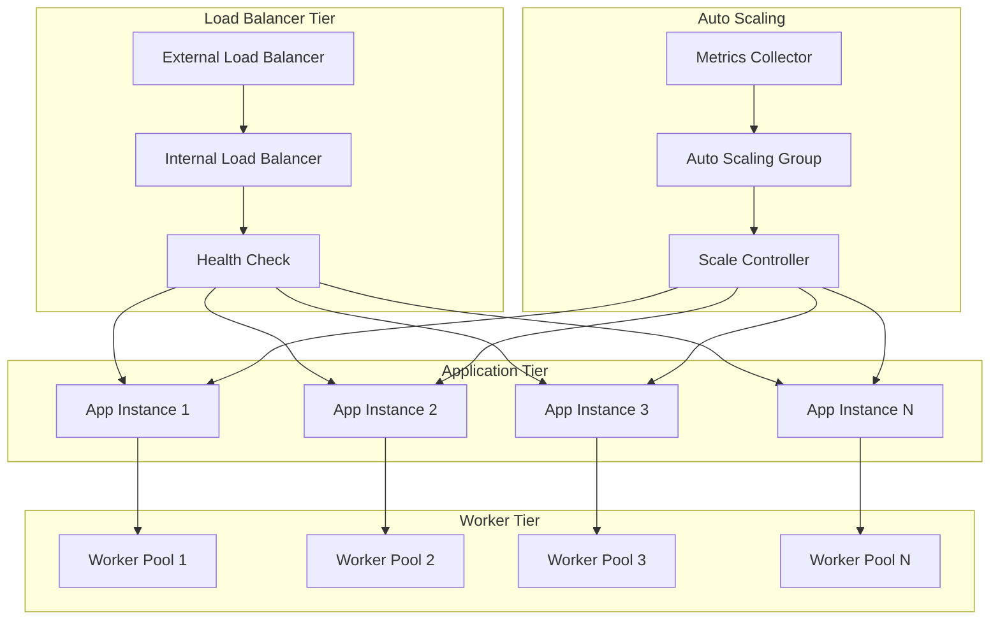

## Security and Compliance Flow

### Authentication and Authorization
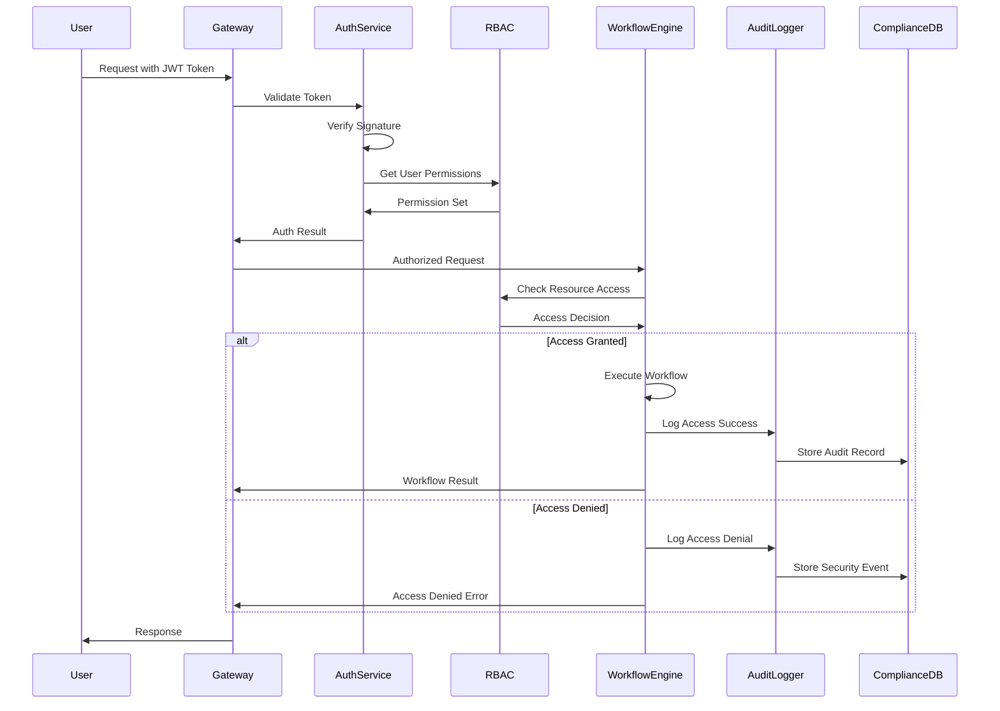

### Data Encryption Flow
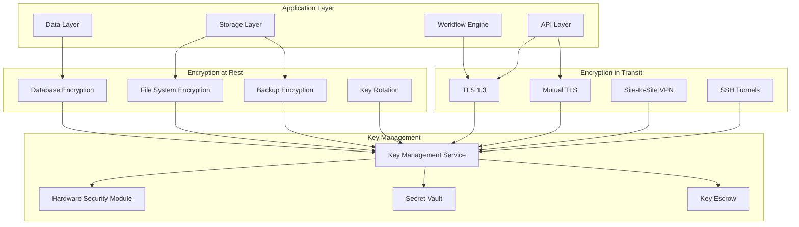

## Disaster Recovery Data Flow

### Backup and Recovery Architecture
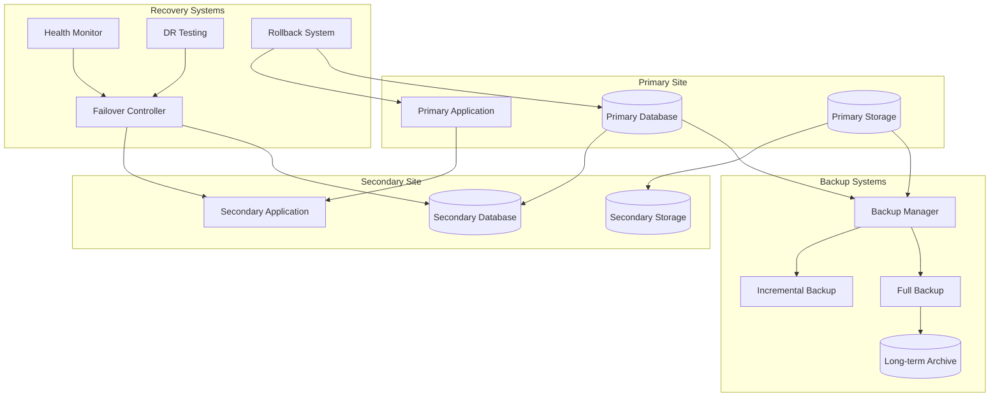

These comprehensive data flow diagrams provide enterprise architects and developers with clear visualizations of how data moves through the HIVE QUEEN BDD architecture, enabling better understanding of system interactions, performance bottlenecks, and security boundaries.