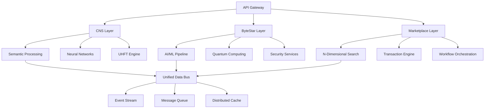
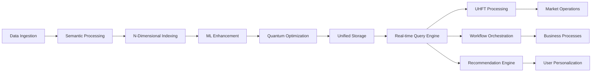
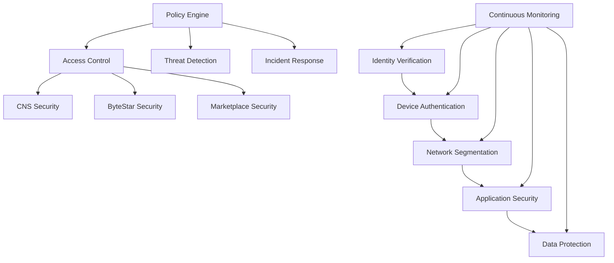
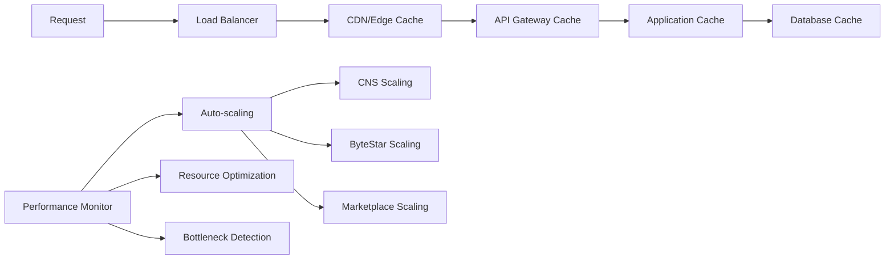

# Unified Architecture: CNS-ByteStar-Marketplace Integration

## Executive Summary

This document defines the unified architecture that integrates three major system components:
- **CNS (Cognitive Neural System)**: OWL Compiler, UHFT, BitActor, Healing/Evolution engines, IR system
- **ByteStar**: AI/ML models, quantum computing, data processing, security systems  
- **Marketplace**: N-dimensional data models, Citty-pro workflow orchestration, auction system, recommendation engine

The unified architecture provides a cohesive, scalable, and high-performance platform for intelligent marketplace operations with advanced cognitive capabilities.

## 1. System Overview

### 1.1 Core Architecture Principles



### 1.2 System Integration Layers

| Layer | Purpose | Components | Technology Stack |
|-------|---------|------------|------------------|
| **Presentation** | User interfaces, API endpoints | Web UI, Mobile Apps, API Gateway | React/Vue, Node.js, Kong/Nginx |
| **Application** | Business logic, orchestration | Workflow Engine, Service Mesh | Citty-Pro, Kubernetes, Istio |
| **Intelligence** | AI/ML, cognitive processing | Neural Networks, Quantum Compute | TensorFlow, Qiskit, PyTorch |
| **Data** | Storage, processing, streaming | Multi-dimensional databases | PostgreSQL, Redis, Kafka |
| **Infrastructure** | Compute, network, security | Container orchestration | Docker, Kubernetes, Vault |

## 2. Component Integration Architecture

### 2.1 CNS Components Integration

```typescript
// CNS System Interface
interface CNSSystem {
  owlCompiler: OWLCompiler;
  uhftEngine: UHFTEngine;
  bitActor: BitActorSystem;
  healingEngine: HealingEngine;
  evolutionEngine: EvolutionEngine;
  irSystem: IntermediateRepresentation;
}

// OWL Compiler for Semantic Ontologies
interface OWLCompiler {
  compileOntology(owlSource: string): SemanticModel;
  validateSemantics(model: SemanticModel): ValidationResult;
  generateInferences(model: SemanticModel): InferenceSet;
  queryOntology(query: SPARQLQuery): QueryResult[];
}

// Ultra High-Frequency Trading Engine
interface UHFTEngine {
  processMarketData(data: MarketDataStream): TradingSignal[];
  executeStrategy(strategy: TradingStrategy): ExecutionResult;
  riskAssessment(position: Position): RiskMetrics;
  latencyOptimization(): PerformanceMetrics;
}

// Distributed BitActor Processing
interface BitActorSystem {
  spawnActor<T>(config: ActorConfig<T>): Actor<T>;
  distributeComputation(task: ComputationTask): Promise<Result>;
  coordinateActors(actors: Actor[]): CoordinationResult;
  faultTolerance(): FaultToleranceConfig;
}
```

### 2.2 ByteStar Components Integration

```typescript
// ByteStar AI/ML Pipeline
interface ByteStarSystem {
  mlPipeline: MLPipelineEngine;
  quantumCompute: QuantumProcessor;
  dataProcessor: DataProcessingEngine;
  securitySystem: SecurityOrchestrator;
}

// AI/ML Models and Pipeline
interface MLPipelineEngine {
  trainModel(config: ModelConfig, data: TrainingData): Promise<Model>;
  deployModel(model: Model): DeploymentResult;
  runInference(model: Model, input: InputData): InferenceResult;
  modelOptimization(model: Model): OptimizedModel;
}

// Quantum Computing Features
interface QuantumProcessor {
  quantumCircuit(gates: QuantumGate[]): QuantumCircuit;
  executeCircuit(circuit: QuantumCircuit): QuantumResult;
  quantumML(algorithm: QMLAlgorithm): QMLResult;
  noiseReduction(result: QuantumResult): CorrectedResult;
}

// Advanced Security Systems
interface SecurityOrchestrator {
  zeroTrustPolicy(): SecurityPolicy;
  threatDetection(data: SecurityData): ThreatAssessment;
  encryptionService(): EncryptionProvider;
  accessControl(): AuthorizationEngine;
}
```

### 2.3 Marketplace Components Integration

```typescript
// Marketplace System with N-Dimensional Models
interface MarketplaceSystem {
  dimensionalSearch: DimensionalSearchEngine;
  transactionEngine: TransactionEngine;
  workflowOrchestration: CittyProEngine;
  auctionSystem: AuctionEngine;
  recommendationEngine: RecommendationSystem;
}

// Enhanced with CNS and ByteStar integration
class UnifiedMarketplaceSystem implements MarketplaceSystem {
  constructor(
    private cns: CNSSystem,
    private byteStar: ByteStarSystem
  ) {}

  // Semantic-aware dimensional search
  enhancedSearch(query: SearchQuery): Promise<SemanticSearchResult> {
    const semanticModel = this.cns.owlCompiler.compileOntology(query.ontology);
    const dimensionalResults = this.dimensionalSearch.search(query);
    const mlEnhancement = this.byteStar.mlPipeline.runInference(
      this.recommendationModel, 
      { query, results: dimensionalResults }
    );
    
    return this.combineResults(dimensionalResults, mlEnhancement, semanticModel);
  }
}
```

## 3. Data Flow Architecture

### 3.1 Multi-Dimensional Data Pipeline



### 3.2 Event-Driven Data Flow

```typescript
// Unified Event System
interface UnifiedEventSystem {
  // CNS Events
  semanticEvents: EventStream<SemanticEvent>;
  uhftEvents: EventStream<TradingEvent>;
  actorEvents: EventStream<ActorLifecycleEvent>;
  
  // ByteStar Events  
  mlEvents: EventStream<MLEvent>;
  quantumEvents: EventStream<QuantumEvent>;
  securityEvents: EventStream<SecurityEvent>;
  
  // Marketplace Events
  transactionEvents: EventStream<TransactionEvent>;
  searchEvents: EventStream<SearchEvent>;
  workflowEvents: EventStream<WorkflowEvent>;
}

// Event Processing Pipeline
class EventProcessingPipeline {
  async processEvent<T>(event: Event<T>): Promise<ProcessingResult> {
    // 1. Semantic enrichment via CNS
    const semanticContext = await this.cns.owlCompiler
      .generateInferences(event.data);
    
    // 2. ML enhancement via ByteStar
    const mlInsights = await this.byteStar.mlPipeline
      .runInference(this.eventModel, event.data);
    
    // 3. Workflow routing via Marketplace
    const workflowDecision = await this.marketplace.workflowOrchestration
      .route(event, semanticContext, mlInsights);
    
    return this.executeWorkflow(workflowDecision);
  }
}
```

## 4. API Gateway Design

### 4.1 Unified API Architecture

```yaml
# API Gateway Configuration
apiVersion: v1
kind: ConfigMap
metadata:
  name: unified-api-gateway
data:
  gateway.yaml: |
    routes:
      # CNS APIs
      - name: semantic-api
        path: /api/v1/semantic/*
        service: cns-semantic-service
        middleware:
          - auth
          - rate-limit
          - semantic-validation
          
      - name: uhft-api
        path: /api/v1/trading/*
        service: cns-uhft-service
        middleware:
          - auth
          - low-latency
          - risk-check
          
      # ByteStar APIs
      - name: ml-api
        path: /api/v1/ml/*
        service: bytestar-ml-service
        middleware:
          - auth
          - resource-limit
          - model-validation
          
      - name: quantum-api
        path: /api/v1/quantum/*
        service: bytestar-quantum-service
        middleware:
          - auth
          - quantum-auth
          - circuit-validation
          
      # Marketplace APIs
      - name: marketplace-api
        path: /api/v1/marketplace/*
        service: marketplace-core-service
        middleware:
          - auth
          - dimensional-validation
          - transaction-security
    
    middleware:
      auth:
        type: jwt
        secret: ${JWT_SECRET}
        issuer: unified-system
        
      rate-limit:
        requests_per_second: 1000
        burst: 2000
        
      low-latency:
        timeout: 1ms
        connection_pool_size: 1000
```

### 4.2 GraphQL Federation

```graphql
# Unified GraphQL Schema
type Query {
  # CNS Queries
  semanticSearch(query: String!, ontology: String): [SemanticResult!]!
  tradingSignals(market: String!, timeframe: String!): [TradingSignal!]!
  
  # ByteStar Queries  
  mlInference(modelId: ID!, input: JSON!): InferenceResult!
  quantumComputation(circuit: QuantumCircuitInput!): QuantumResult!
  
  # Marketplace Queries
  dimensionalSearch(query: SearchInput!): SearchResult!
  transactions(filter: TransactionFilter!): [Transaction!]!
}

type Mutation {
  # Unified operations that span multiple systems
  intelligentTrade(request: TradeRequest!): TradeResult!
  optimizedWorkflow(definition: WorkflowInput!): WorkflowResult!
  semanticTransaction(transaction: TransactionInput!): TransactionResult!
}

# Federated services
extend type Product @key(fields: "id") {
  # CNS semantic data
  semanticProperties: SemanticProperties @external
  # ByteStar ML recommendations
  mlRecommendations: [Recommendation!]! @external
}
```

## 5. Security Architecture

### 5.1 Zero-Trust Security Model



### 5.2 Multi-Layer Security Implementation

```typescript
// Unified Security Architecture
interface UnifiedSecurity {
  // Authentication & Authorization
  identityManager: IdentityManager;
  authorizationEngine: AuthorizationEngine;
  
  // Encryption & Key Management
  encryptionService: EncryptionService;
  keyManager: KeyManager;
  
  // Threat Detection & Response
  threatDetector: ThreatDetector;
  incidentResponse: IncidentResponseSystem;
  
  // Audit & Compliance
  auditLogger: AuditLogger;
  complianceChecker: ComplianceChecker;
}

// Security Policy Configuration
const securityPolicies: SecurityPolicy[] = [
  {
    domain: 'CNS',
    policies: {
      semanticAccess: 'role:semantic-analyst,data-scientist',
      uhftAccess: 'role:trader,risk-manager',
      actorSpawn: 'role:system-admin,architect',
    }
  },
  {
    domain: 'ByteStar', 
    policies: {
      mlModelAccess: 'role:ml-engineer,data-scientist',
      quantumAccess: 'role:quantum-researcher,physicist',
      securityConfig: 'role:security-admin',
    }
  },
  {
    domain: 'Marketplace',
    policies: {
      transactionCreate: 'role:buyer,seller',
      workflowDeploy: 'role:business-analyst,developer',
      systemConfig: 'role:marketplace-admin',
    }
  }
];
```

## 6. Performance Optimization Strategy

### 6.1 Performance Architecture



### 6.2 Optimization Strategies

#### 6.2.1 CNS Performance Optimization

```typescript
// UHFT Performance Optimizations
interface UHFTOptimizations {
  // Ultra-low latency networking
  kernelBypass: boolean;
  rdmaNetworking: boolean;
  
  // Memory optimization
  lockFreeDataStructures: boolean;
  memoryPinning: boolean;
  
  // CPU optimization  
  cpuAffinity: number[];
  realTimePriority: boolean;
}

// Semantic Processing Optimization
interface SemanticOptimizations {
  // Parallel processing
  ontologyPartitioning: boolean;
  parallelInference: boolean;
  
  // Caching strategies
  inferenceCache: CacheConfig;
  ontologyCache: CacheConfig;
  
  // Index optimization
  semanticIndexing: IndexConfig;
  queryOptimization: QueryOptimizerConfig;
}
```

#### 6.2.2 ByteStar Performance Optimization

```typescript
// ML Pipeline Optimization
interface MLOptimizations {
  // Model optimization
  modelQuantization: boolean;
  modelPruning: boolean;
  modelDistillation: boolean;
  
  // Hardware acceleration
  gpuAcceleration: boolean;
  tpuIntegration: boolean;
  
  // Batch processing
  batchOptimization: BatchConfig;
  dynamicBatching: boolean;
}

// Quantum Computing Optimization
interface QuantumOptimizations {
  // Circuit optimization
  circuitDepthReduction: boolean;
  gateOptimization: boolean;
  
  // Noise mitigation
  errorCorrection: boolean;
  noiseReduction: boolean;
  
  // Hybrid algorithms
  hybridQuantumClassical: boolean;
  variationalAlgorithms: boolean;
}
```

#### 6.2.3 Marketplace Performance Optimization

```typescript
// N-Dimensional Search Optimization
interface SearchOptimizations {
  // Index structures
  kdTreeOptimization: boolean;
  lshIndexing: boolean;
  
  // Query optimization
  queryPlanOptimization: boolean;
  dimensionalPruning: boolean;
  
  // Caching
  searchResultCache: CacheConfig;
  dimensionalCache: CacheConfig;
}

// Transaction Processing Optimization
interface TransactionOptimizations {
  // Parallel processing
  parallelValidation: boolean;
  concurrentExecution: boolean;
  
  // State management
  eventSourcing: boolean;
  cqrsPattern: boolean;
  
  // Database optimization
  sharding: ShardingConfig;
  readReplicas: ReplicaConfig;
}
```

## 7. Deployment Architecture

### 7.1 Microservices Architecture

```yaml
# Kubernetes Deployment Architecture
apiVersion: v1
kind: Namespace
metadata:
  name: unified-system
---
# CNS Services
apiVersion: apps/v1
kind: Deployment
metadata:
  name: cns-semantic-service
  namespace: unified-system
spec:
  replicas: 3
  selector:
    matchLabels:
      app: cns-semantic
  template:
    metadata:
      labels:
        app: cns-semantic
    spec:
      containers:
      - name: semantic-processor
        image: cns/semantic-processor:v1.0
        resources:
          requests:
            memory: "2Gi"
            cpu: "1000m"
          limits:
            memory: "4Gi"
            cpu: "2000m"
        env:
        - name: OWL_COMPILER_CONFIG
          valueFrom:
            configMapKeyRef:
              name: cns-config
              key: owl-compiler.yaml
---
apiVersion: apps/v1
kind: Deployment
metadata:
  name: cns-uhft-service
  namespace: unified-system
spec:
  replicas: 5
  selector:
    matchLabels:
      app: cns-uhft
  template:
    metadata:
      labels:
        app: cns-uhft
    spec:
      containers:
      - name: uhft-engine
        image: cns/uhft-engine:v1.0
        resources:
          requests:
            memory: "8Gi"
            cpu: "4000m"
          limits:
            memory: "16Gi"
            cpu: "8000m"
        securityContext:
          capabilities:
            add:
            - SYS_NICE # For real-time priority
            - IPC_LOCK # For memory pinning
---
# ByteStar Services  
apiVersion: apps/v1
kind: Deployment
metadata:
  name: bytestar-ml-service
  namespace: unified-system
spec:
  replicas: 4
  selector:
    matchLabels:
      app: bytestar-ml
  template:
    metadata:
      labels:
        app: bytestar-ml
    spec:
      containers:
      - name: ml-pipeline
        image: bytestar/ml-pipeline:v1.0
        resources:
          requests:
            memory: "4Gi"
            cpu: "2000m"
            nvidia.com/gpu: 1
          limits:
            memory: "8Gi"
            cpu: "4000m"
            nvidia.com/gpu: 2
---
# Marketplace Services
apiVersion: apps/v1  
kind: Deployment
metadata:
  name: marketplace-core-service
  namespace: unified-system
spec:
  replicas: 6
  selector:
    matchLabels:
      app: marketplace-core
  template:
    metadata:
      labels:
        app: marketplace-core
    spec:
      containers:
      - name: marketplace-api
        image: marketplace/core-api:v1.0
        resources:
          requests:
            memory: "2Gi"
            cpu: "1000m"
          limits:
            memory: "4Gi"
            cpu: "2000m"
```

### 7.2 Service Mesh Configuration

```yaml
# Istio Service Mesh Configuration
apiVersion: networking.istio.io/v1beta1
kind: VirtualService
metadata:
  name: unified-system-routing
  namespace: unified-system
spec:
  hosts:
  - unified-api.example.com
  gateways:
  - unified-gateway
  http:
  # CNS routing with low-latency optimization
  - match:
    - uri:
        prefix: /api/v1/trading
    route:
    - destination:
        host: cns-uhft-service
    timeout: 1ms
    
  # ByteStar routing with ML optimization  
  - match:
    - uri:
        prefix: /api/v1/ml
    route:
    - destination:
        host: bytestar-ml-service
    timeout: 30s
    
  # Marketplace routing with dimensional search
  - match:
    - uri:
        prefix: /api/v1/marketplace
    route:
    - destination:
        host: marketplace-core-service
    timeout: 10s
---
# Traffic policies
apiVersion: networking.istio.io/v1beta1
kind: DestinationRule
metadata:
  name: unified-system-policies
  namespace: unified-system
spec:
  host: "*.unified-system.svc.cluster.local"
  trafficPolicy:
    tls:
      mode: ISTIO_MUTUAL
    connectionPool:
      tcp:
        maxConnections: 1000
      http:
        http1MaxPendingRequests: 100
        maxRequestsPerConnection: 10
    loadBalancer:
      simple: LEAST_CONN
    outlierDetection:
      consecutiveErrors: 3
      interval: 30s
      baseEjectionTime: 30s
```

## 8. System Components Documentation

### 8.1 CNS Components

#### 8.1.1 OWL Compiler
- **Purpose**: Semantic ontology compilation and inference
- **Input**: OWL ontology files, SPARQL queries
- **Output**: Semantic models, inference results
- **Integration Points**: Marketplace semantic search, ByteStar ML enhancement

#### 8.1.2 UHFT Engine  
- **Purpose**: Ultra-high frequency trading operations
- **Input**: Market data streams, trading strategies
- **Output**: Trading signals, execution results
- **Integration Points**: Marketplace transaction engine, ByteStar risk models

#### 8.1.3 BitActor System
- **Purpose**: Distributed actor-based computation
- **Input**: Computation tasks, coordination requirements
- **Output**: Distributed results, fault tolerance
- **Integration Points**: All system components for distributed processing

### 8.2 ByteStar Components

#### 8.2.1 ML Pipeline
- **Purpose**: Machine learning model training and inference
- **Input**: Training data, model configurations
- **Output**: Trained models, inference results
- **Integration Points**: Marketplace recommendations, CNS semantic enhancement

#### 8.2.2 Quantum Processor
- **Purpose**: Quantum computing operations
- **Input**: Quantum circuits, quantum algorithms
- **Output**: Quantum computation results
- **Integration Points**: Optimization problems across all systems

#### 8.2.3 Security Orchestrator
- **Purpose**: Unified security management
- **Input**: Security policies, threat data
- **Output**: Security decisions, threat responses
- **Integration Points**: All system components for security enforcement

### 8.3 Marketplace Components

#### 8.3.1 N-Dimensional Search
- **Purpose**: Multi-dimensional data search and retrieval
- **Input**: Search queries, dimensional data
- **Output**: Ranked search results
- **Integration Points**: CNS semantic enhancement, ByteStar ML ranking

#### 8.3.2 Transaction Engine
- **Purpose**: Secure transaction processing
- **Input**: Transaction requests, validation rules
- **Output**: Transaction results, audit trails
- **Integration Points**: CNS fraud detection, ByteStar security validation

#### 8.3.3 Workflow Orchestration
- **Purpose**: Business process automation
- **Input**: Workflow definitions, execution triggers
- **Output**: Workflow results, process metrics
- **Integration Points**: All system components for orchestration

## 9. Integration Patterns

### 9.1 Event-Driven Integration

```typescript
// Unified Event Bus
class UnifiedEventBus {
  private eventStore: EventStore;
  private processors: Map<string, EventProcessor>;
  
  async publishEvent<T>(event: DomainEvent<T>): Promise<void> {
    // Store event
    await this.eventStore.append(event);
    
    // Route to appropriate processors
    const relevantProcessors = this.getProcessorsForEvent(event);
    
    // Parallel processing
    await Promise.all(
      relevantProcessors.map(processor => 
        processor.process(event)
      )
    );
  }
  
  private getProcessorsForEvent(event: DomainEvent<any>): EventProcessor[] {
    // CNS processors
    if (event.domain === 'semantic') {
      return [this.processors.get('cns-semantic')!];
    }
    if (event.domain === 'trading') {
      return [this.processors.get('cns-uhft')!];
    }
    
    // ByteStar processors
    if (event.domain === 'ml') {
      return [this.processors.get('bytestar-ml')!];
    }
    if (event.domain === 'quantum') {
      return [this.processors.get('bytestar-quantum')!];
    }
    
    // Marketplace processors
    if (event.domain === 'transaction') {
      return [
        this.processors.get('marketplace-transaction')!,
        this.processors.get('cns-fraud-detection')!,
        this.processors.get('bytestar-security')!
      ];
    }
    
    return [];
  }
}
```

### 9.2 Saga Pattern for Distributed Transactions

```typescript
// Distributed Transaction Saga
class IntelligentTradingSaga {
  async execute(request: IntelligentTradeRequest): Promise<TradeResult> {
    const sagaId = this.generateSagaId();
    
    try {
      // Step 1: CNS Market Analysis
      const marketAnalysis = await this.cnsService.analyzeMarket({
        symbol: request.symbol,
        strategy: request.strategy
      });
      
      // Step 2: ByteStar Risk Assessment  
      const riskAssessment = await this.bytestarService.assessRisk({
        position: request.position,
        marketConditions: marketAnalysis
      });
      
      // Step 3: Marketplace Position Creation
      const positionResult = await this.marketplaceService.createPosition({
        trade: request,
        analysis: marketAnalysis,
        risk: riskAssessment
      });
      
      // Step 4: CNS UHFT Execution
      const executionResult = await this.cnsService.executeTrade({
        position: positionResult.position,
        timing: 'optimal'
      });
      
      return {
        sagaId,
        success: true,
        result: executionResult
      };
      
    } catch (error) {
      // Compensating transactions
      await this.compensate(sagaId, error);
      throw error;
    }
  }
}
```

## 10. Monitoring and Observability

### 10.1 Unified Monitoring Architecture

```yaml
# Prometheus monitoring configuration
apiVersion: v1
kind: ConfigMap
metadata:
  name: prometheus-config
data:
  prometheus.yml: |
    global:
      scrape_interval: 15s
      
    scrape_configs:
    # CNS monitoring
    - job_name: 'cns-semantic'
      static_configs:
      - targets: ['cns-semantic-service:8080']
      metrics_path: /metrics
      
    - job_name: 'cns-uhft'  
      static_configs:
      - targets: ['cns-uhft-service:8080']
      metrics_path: /metrics
      scrape_interval: 1s # High frequency for UHFT
      
    # ByteStar monitoring
    - job_name: 'bytestar-ml'
      static_configs:
      - targets: ['bytestar-ml-service:8080']
      metrics_path: /metrics
      
    # Marketplace monitoring  
    - job_name: 'marketplace-core'
      static_configs:
      - targets: ['marketplace-core-service:8080']
      metrics_path: /metrics
      
    # Custom metrics
    rule_files:
    - "unified-system-rules.yml"
    
    alerting:
      alertmanagers:
      - static_configs:
        - targets: ['alertmanager:9093']
```

### 10.2 Distributed Tracing

```typescript
// OpenTelemetry integration
class UnifiedTracing {
  private tracer = trace.getTracer('unified-system');
  
  async traceIntelligentOperation<T>(
    operationName: string,
    operation: () => Promise<T>
  ): Promise<T> {
    return this.tracer.startActiveSpan(operationName, async (span) => {
      try {
        // Add system context
        span.setAttributes({
          'unified.system.version': '1.0.0',
          'unified.operation.type': operationName,
          'unified.timestamp': Date.now()
        });
        
        const result = await operation();
        
        span.setStatus({ code: SpanStatusCode.OK });
        return result;
        
      } catch (error) {
        span.setStatus({ 
          code: SpanStatusCode.ERROR,
          message: error.message 
        });
        throw error;
      } finally {
        span.end();
      }
    });
  }
}
```

## 11. Conclusion

This unified architecture provides a comprehensive integration framework that combines the strengths of CNS, ByteStar, and Marketplace systems into a cohesive, intelligent platform. The architecture emphasizes:

- **Semantic Intelligence**: Through CNS OWL compiler and semantic processing
- **High-Performance Trading**: Via CNS UHFT engine with microsecond latency
- **Advanced AI/ML**: Through ByteStar ML pipelines and quantum computing
- **Sophisticated Marketplace**: With n-dimensional search and workflow orchestration
- **Enterprise Security**: Zero-trust security model with comprehensive threat protection
- **Scalable Performance**: Microservices architecture with intelligent optimization
- **Operational Excellence**: Full observability and automated operations

The unified system enables sophisticated use cases such as:
- Semantic-aware intelligent trading
- Quantum-optimized marketplace recommendations  
- AI-enhanced workflow orchestration
- Real-time fraud detection with ML
- Multi-dimensional personalization

This architecture serves as the foundation for next-generation intelligent marketplace operations with cognitive capabilities spanning semantic processing, ultra-high-frequency trading, advanced AI/ML, and quantum computing integration.