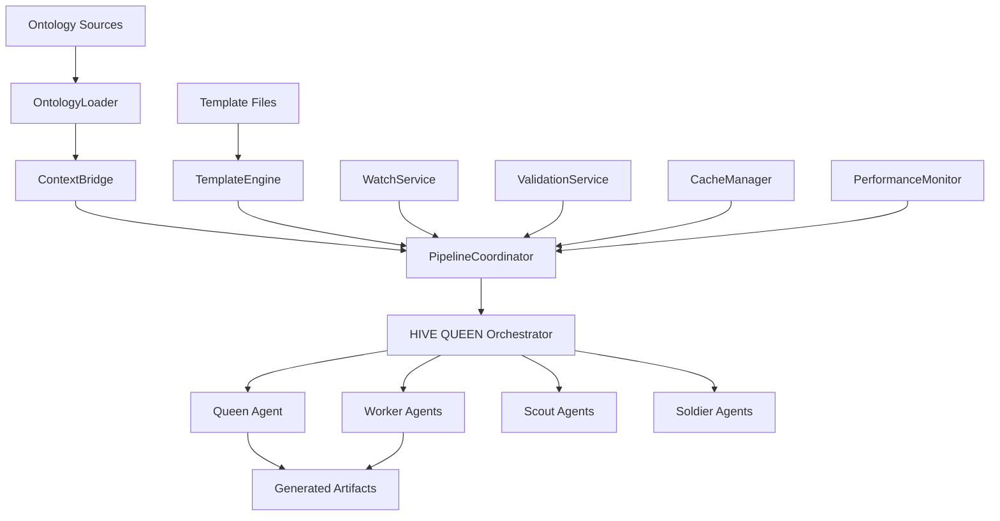
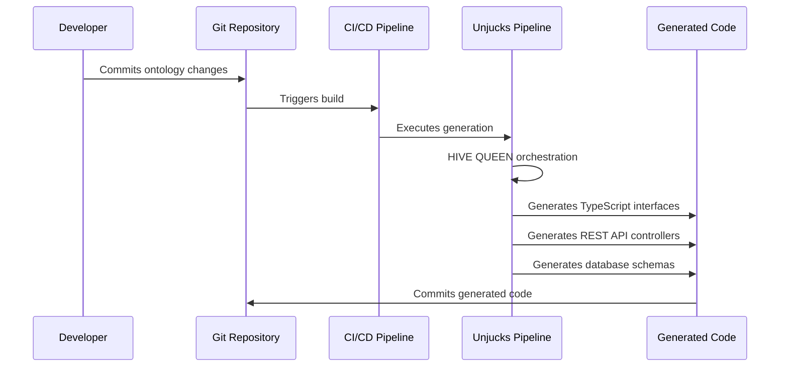

# Untology → Unjucks Pipeline Architecture

## System Architecture Overview

The Untology → Unjucks integration creates a unified pipeline that transforms ontology data (RDF/OWL/Turtle) into generated artifacts through powerful templating, orchestrated by HIVE QUEEN for enterprise-scale performance.



## Core Components

### 1. Pipeline Coordinator

**Responsibility**: Orchestrates the entire pipeline execution with HIVE QUEEN integration.

**Key Features**:
- Job management and lifecycle tracking
- Error handling and recovery
- Performance monitoring integration
- Event-driven architecture

**HIVE QUEEN Roles**:
- **Queen**: Central orchestrator managing the entire pipeline
- **Workers**: Parallel template rendering across multiple threads
- **Scouts**: Real-time file watching and change detection
- **Soldiers**: Stress testing and validation of large ontology sets

### 2. Ontology Processing Stack

#### OntologyLoader
- **Formats Supported**: Turtle, N3, RDF-XML, JSON-LD
- **Features**: Syntax validation, statistics extraction, format conversion
- **Caching**: Intelligent caching based on file hash and modification time

#### ContextBridge
- **Function**: Transforms ontology triples into template-friendly context
- **Features**: SPARQL-like querying, triple filtering, namespace resolution
- **Helper Methods**: Class hierarchy navigation, property extraction, instance enumeration

### 3. Template Processing Engine

#### TemplateEngine
- **Base**: Nunjucks templating with extensive customizations
- **Custom Filters**: URI manipulation, string formatting, ontology queries
- **Global Functions**: SPARQL queries, namespace resolution, utility functions
- **Validation**: Template syntax checking, variable analysis

### 4. Enterprise Integration Layer

#### GitHub Integration
- **Features**: GitHub Actions workflows, pre-commit hooks, webhook handling
- **CI/CD Support**: Automated generation on ontology changes
- **Multi-team Collaboration**: Branch-based ontology management

#### Jenkins Integration
- **Pipeline Types**: Declarative, scripted, shared libraries
- **Enterprise Features**: Blue Ocean support, JCasC configuration
- **Monitoring**: Build metrics, artifact archiving, notifications

### 5. Supporting Services

#### WatchService
- **Technology**: Chokidar for cross-platform file watching
- **Features**: Debounced change detection, ignore patterns, selective monitoring
- **Performance**: Efficient handling of large file trees

#### ValidationService  
- **Levels**: Configuration, ontology syntax, template syntax, output validation
- **Modes**: Strict and relaxed validation for different environments
- **Reports**: Detailed error reporting with context and suggestions

#### CacheManager
- **Strategy**: Multi-level caching (memory + persistent disk)
- **Intelligence**: Dependency tracking, automatic invalidation, TTL management
- **Performance**: Significant speedup for repeated operations

#### PerformanceMonitor
- **Metrics**: Execution time, resource usage, throughput analysis
- **Alerting**: Configurable thresholds for performance degradation
- **Reporting**: Detailed performance reports with recommendations

## Production Workflow Patterns

### 1. Multi-Team Software Architecture

```yaml
# Enterprise configuration supporting multiple teams
ontologies:
  - path: ./teams/backend/services.ttl
    namespace: https://company.com/backend#
  - path: ./teams/frontend/components.ttl
    namespace: https://company.com/frontend#
  - path: ./teams/data/models.ttl
    namespace: https://company.com/data#

hiveQueen:
  enabled: true
  workers: 8
  parallelism: both
```

**Benefits**:
- Team isolation through namespace filtering  
- Parallel processing for faster generation
- Consistent documentation across teams

### 2. API Code Generation Pipeline



### 3. Compliance Automation Workflow

**GDPR Example**:
- **Input**: GDPR ontology + data processing records
- **Templates**: Privacy policies, consent forms, data mapping reports
- **Output**: Legally compliant documentation
- **Validation**: Strict compliance checking

### 4. Real-time Development Workflow

```javascript
// Development with hot-reloading
const { stop } = await startWatchMode('./config.yaml', {
  hiveQueen: { workers: 2 },
  watch: { debounce: 300 },
});

// Automatic regeneration on ontology/template changes
// Fast feedback loop for developers
```

## Scalability and Performance

### Horizontal Scaling with HIVE QUEEN

**Worker Distribution Strategies**:
- **Templates**: Parallel rendering of different templates
- **Ontologies**: Parallel processing of multiple ontology files  
- **Both**: Maximum parallelization for enterprise workloads

**Performance Characteristics**:
- **Small Projects**: 2-4 workers, sub-second generation
- **Medium Projects**: 4-8 workers, 1-5 second generation
- **Enterprise Projects**: 8-16 workers, 5-30 second generation

### Caching Strategy

**Multi-level Caching**:
1. **Memory Cache**: Hot data for immediate access
2. **Persistent Cache**: Cross-session ontology parsing results
3. **Template Cache**: Compiled template cache for faster rendering
4. **Result Cache**: Generated artifact caching with dependency tracking

**Cache Invalidation**:
- File hash-based ontology cache keys
- Template modification time tracking
- Dependency graph for cascading invalidation

### Memory Management

**Large Ontology Handling**:
- Streaming ontology parsing for memory efficiency
- Lazy loading of ontology segments
- Garbage collection optimization for long-running processes

## Error Handling and Resilience

### Error Recovery Mechanisms

**Graceful Degradation**:
- Continue processing unaffected templates on partial failures
- Detailed error reporting with context preservation
- Rollback mechanisms for failed generation attempts

**Validation Layers**:
1. **Pre-processing**: Configuration and file existence validation
2. **Parsing**: Ontology syntax validation with line-level error reporting
3. **Template**: Syntax and variable validation before rendering
4. **Post-processing**: Generated output validation against schemas

### Monitoring and Alerting

**Performance Monitoring**:
- Real-time metrics collection during generation
- Resource usage tracking (CPU, memory, I/O)
- Bottleneck identification and recommendations

**Alert Categories**:
- **Performance**: Slow operations, high resource usage
- **Errors**: Parsing failures, template errors, output validation failures
- **Quality**: Missing documentation, potential issues in generated code

## Security Considerations

### Input Validation
- Ontology file format validation
- Template sandbox execution
- Path traversal protection in file operations

### Access Control
- File system permission respect
- Template inclusion restrictions
- Output directory access controls  

### CI/CD Security
- Secure credential handling in automation scripts
- Branch protection for generated code commits
- Audit logging for enterprise deployments

## Extension Points

### Custom Filters and Functions
- Plugin architecture for domain-specific template functions
- Custom ontology analysis tools
- Integration with external data sources

### Integration Adapters
- Custom CI/CD platform support
- Enterprise tool integrations (JIRA, Confluence, etc.)
- Monitoring system integrations (Prometheus, Grafana)

### Processing Hooks
- Pre/post processing hooks for custom logic
- Event-driven integrations with external systems
- Custom validation rule implementations

## Deployment Patterns

### Containerized Deployment
```dockerfile
FROM node:18-alpine
RUN npm install -g @citty-pro/untology-unjucks
COPY . /app
WORKDIR /app
CMD ["unjucks", "sync", "--config", "./config.yaml"]
```

### Serverless Functions
- AWS Lambda integration for event-driven generation
- Azure Functions for enterprise Microsoft environments
- Google Cloud Functions for scalable processing

### Self-hosted Solutions
- Docker Compose for development environments
- Kubernetes deployments for enterprise scale
- Traditional server deployments with systemd integration

This architecture provides a robust, scalable, and enterprise-ready solution for ontology-to-artifact generation with comprehensive tooling for modern software development workflows.