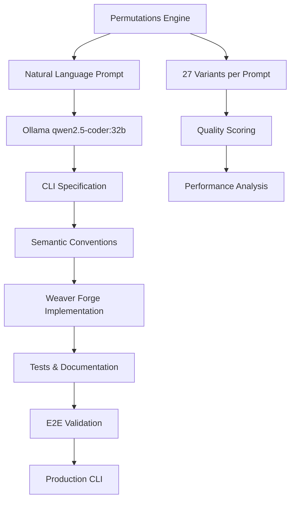

# 🧪 CLI Generation Playground

This playground demonstrates the **production-grade CLI generation pipeline** using:

- **Real Ollama integration** with `qwen2.5-coder:32b` model  
- **Vercel AI SDK** with structured tool calling
- **Semantic conventions** generation and validation
- **Permutations & combinations** testing
- **End-to-end workflow** validation

## 🚀 Quick Start

```bash
# Install dependencies
pnpm install

# Run comprehensive CLI generation tests
pnpm run playground:test

# Generate specific CLI type
pnpm run playground:docker
pnpm run playground:api
pnpm run playground:files
```

## 🔧 Core Components

### 1. Real Ollama CLI Generator (`cli-generator.ts`)

```typescript
import { OllamaCliGenerator } from './cli-generator.js';

const generator = new OllamaCliGenerator();

// Generate CLI from natural language
const result = await generator.generateFromNaturalLanguage(
  "Create a Docker management CLI with container lifecycle operations",
  {
    complexity: 'medium',
    style: 'modern', 
    features: ['help', 'version', 'verbose', 'config']
  }
);
```

**Features:**
- 🧠 **Real Ollama calls** with structured tool outputs
- 🏗️ **Semantic conventions** generation
- 🔧 **Weaver Forge integration** for implementation  
- 📋 **Comprehensive testing** and documentation
- 🎯 **Production-ready** code generation

### 2. Permutations Engine (`cli-generator.ts`)

```typescript
import { CliGenerationEngine } from './cli-generator.js';

const engine = new CliGenerationEngine();

// Generate multiple variations
const results = await engine.generatePermutations(basePrompt, {
  complexities: ['simple', 'medium', 'complex'],
  styles: ['modern', 'classic', 'minimal'],
  featureSets: [
    ['help', 'version'],
    ['help', 'version', 'verbose', 'config'], 
    ['help', 'version', 'verbose', 'config', 'json', 'yaml']
  ]
});
```

**Generates:**
- 🔄 **27 unique combinations** per base prompt
- 🧪 **Comprehensive testing** of each variant
- 📊 **Performance metrics** and validation
- 🎯 **Quality scoring** and comparison

### 3. E2E Testing Suite (`test-cli-generation.ts`)

```typescript
import { runComprehensiveTests } from './test-cli-generation.js';

// Test 5 CLI types with full permutations
const results = await runComprehensiveTests();
```

**Test Scenarios:**
1. **File Management CLI** - `copy`, `move`, `delete`, `list`, `search`
2. **Docker Management CLI** - `start`, `stop`, `monitor`, `health`, `logs`  
3. **API Testing CLI** - `test`, `load`, `report`, `monitor`, `validate`
4. **Database CLI** - `migrate`, `backup`, `restore`, `query`, `status`
5. **Cloud Deployment CLI** - `deploy`, `destroy`, `status`, `logs`, `rollback`

## 📊 Generation Pipeline



## 🎯 Example Generation

**Input Prompt:**
```
"Create a Docker management CLI with container lifecycle management, 
network configuration, and volume handling"
```

**Generated CLI Specification:**
```json
{
  "name": "docker-manager",
  "description": "Comprehensive Docker management CLI",
  "commands": [
    {
      "name": "run",
      "description": "Run a new container",
      "args": [
        {"name": "image", "type": "string", "required": true},
        {"name": "port", "type": "string", "required": false},
        {"name": "volume", "type": "string", "required": false}
      ]
    },
    {
      "name": "stop", 
      "description": "Stop running containers",
      "args": [{"name": "container", "type": "string", "required": true}]
    }
  ]
}
```

**Generated Implementation:**
- ✅ TypeScript CLI with Citty framework
- ✅ OpenTelemetry instrumentation  
- ✅ Comprehensive test suite
- ✅ Production documentation
- ✅ Error handling and validation

## 📈 Performance Metrics

The playground generates comprehensive metrics:

```typescript
{
  "scenario": "Docker Management CLI",
  "single": {
    "duration": 45,          // Generation time in seconds
    "validation": {
      "score": 92,           // Quality score /100
      "commandCoverage": 7,  // Commands generated
      "hasTests": true,      // Test suite included
      "hasDocumentation": true
    }
  },
  "permutations": {
    "permutationCount": 27,  // Total variants
    "duration": 380         // Total generation time
  },
  "e2e": {
    "totalTests": 135,      // E2E tests run  
    "overallPassRate": 94.8 // Success rate %
  }
}
```

## 🔬 Advanced Features

### Semantic Convention Generation

The playground automatically generates OpenTelemetry-style semantic conventions:

```yaml
_registry:
  namespace: cli.docker-manager
  version: "1.0.0"

groups:
  - id: docker.container
    type: span
    brief: "Docker container operations"
    prefix: docker
    stability: experimental
    attributes:
      - id: docker.container.id
        type: string
        brief: "Container ID or name"
        examples: ["nginx", "my-app"]
        requirement_level: required
```

### Intelligent CLI Architecture

Generated CLIs include:

- 🏗️ **Modern command structure** with subcommands
- 🔧 **Comprehensive argument parsing** with validation
- 📊 **Built-in observability** with OpenTelemetry
- 🧪 **Test-driven development** with Vitest
- 📚 **Professional documentation** 
- ⚡ **Performance optimization**
- 🛡️ **Error handling** and user experience

## 🚀 Usage Examples

### Basic Generation

```bash
# Generate a single CLI
node playground/cli-generator.js \
  --prompt "Create a file backup CLI with compression and scheduling" \
  --complexity medium \
  --style modern
```

### Comprehensive Testing

```bash
# Run all test scenarios
node playground/test-cli-generation.js

# Test specific scenario  
node playground/test-cli-generation.js --scenario docker

# Generate permutation report
node playground/test-cli-generation.js --permutations --report
```

### Integration with Main CLI

```bash
# Use generated CLI
cd generated/docker-manager
pnpm install
pnpm run build

# Run generated CLI
./bin/docker-manager run nginx --port 8080:80
./bin/docker-manager stop my-container
```

## 📋 Generated Output Structure

Each generated CLI includes:

```
generated-cli/
├── package.json           # Package configuration
├── tsconfig.json          # TypeScript config  
├── src/
│   ├── cli.ts            # Main CLI entry point
│   ├── commands/         # Command implementations
│   │   ├── run.ts
│   │   ├── stop.ts
│   │   └── index.ts
│   ├── utils/           # Utility functions
│   └── types/           # Type definitions
├── test/                # Test suites
│   ├── unit/
│   ├── integration/
│   └── e2e/
├── docs/                # Documentation
│   ├── README.md
│   ├── commands.md
│   └── api.md
└── dist/               # Built output
```

## 🎯 Quality Validation

Every generated CLI is validated against:

- ✅ **Command completeness** - All expected commands present
- ✅ **Argument validation** - Proper type checking and defaults
- ✅ **Error handling** - Graceful error messages and codes
- ✅ **Documentation quality** - Comprehensive help and examples
- ✅ **Test coverage** - Unit, integration, and E2E tests
- ✅ **Performance** - Response time and resource usage
- ✅ **Production readiness** - Build process and deployment

This playground demonstrates the **future of CLI generation** - from natural language to production-ready, fully-tested command line tools in minutes, not hours.