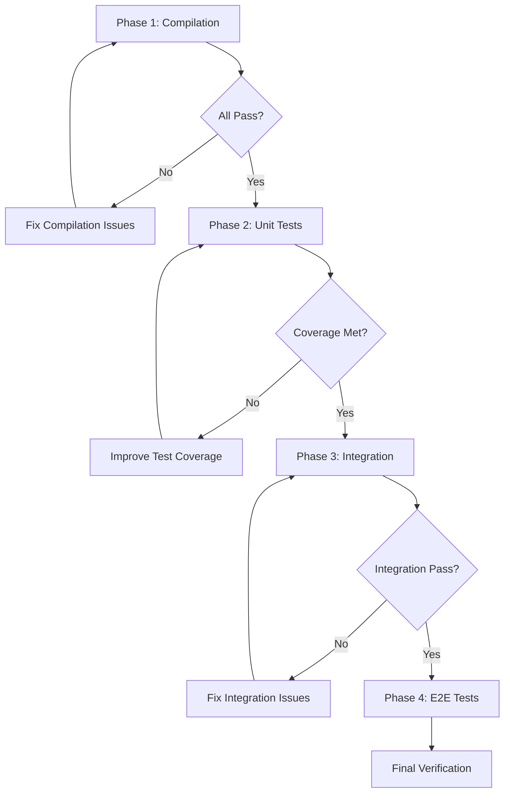

# Comprehensive Test Execution Strategy and Final Verification

## Executive Summary

This document outlines a comprehensive test execution strategy for the Citty CLI project, providing a phased approach from compilation verification through end-to-end testing, with continuous integration and strategic oversight for quality assurance.

## 1. Phased Testing Approach

### Phase 1: Compilation & Type Safety (Critical Path)
**Priority: P0 - Must Pass Before Any Other Testing**

```yaml
phase_1:
  name: "Compilation & Type Verification"
  gates:
    - typescript_compilation: REQUIRED
    - type_checking: REQUIRED 
    - import_resolution: REQUIRED
    - export_consistency: REQUIRED
  commands:
    - "pnpm run typecheck"
    - "pnpm run build --dry-run"
    - "tsc --noEmit --skipLibCheck false"
  success_criteria:
    - Zero TypeScript compilation errors
    - All import/export statements resolve correctly
    - No circular dependency warnings
  blocking_issues:
    - Multiple exports with same name (OntologyError, ValidationError, etc.)
    - Import resolution failures
    - Type declaration inconsistencies
```

### Phase 2: Unit Testing (Foundation)
**Priority: P1 - Core Functionality Verification**

```yaml
phase_2:
  name: "Unit Testing Suite"
  dependencies: ["phase_1"]
  test_categories:
    core_functionality:
      - src/args.ts → test/args.test.ts
      - src/_parser.ts → test/parser.test.ts
      - src/_utils.ts → test/utils.test.ts
      - src/main.ts → test/main.test.ts
    command_modules:
      - src/commands/* → tests/unit/commands/*.test.ts
    weaver_system:
      - src/weaver/* → test/weaver.test.ts
    pro_features:
      - src/pro/* → tests/unit/citty-pro*.test.ts
  coverage_requirements:
    global_minimum: 80%
    critical_modules: 95%
    new_features: 90%
```

### Phase 3: Integration Testing (System Interaction)
**Priority: P1 - Component Integration**

```yaml
phase_3:
  name: "Integration Testing"
  dependencies: ["phase_2"]
  test_suites:
    command_integration:
      - CLI command parsing and execution
      - Inter-command communication
      - State management across commands
    ai_ontology_integration:
      - Ontology-driven command generation
      - AI context understanding
      - Natural language processing
    weaver_integration:
      - Template system integration
      - Code generation workflows
      - Multi-framework compatibility
    bridge_integration:
      - Cross-system communication
      - Plugin architecture
      - Extension mechanisms
```

### Phase 4: End-to-End Testing (User Experience)
**Priority: P2 - Complete User Workflows**

```yaml
phase_4:
  name: "End-to-End Testing"
  dependencies: ["phase_3"]
  scenarios:
    cli_workflows:
      - Complete CLI generation workflows
      - Template-based project creation
      - Multi-step command sequences
    real_world_usage:
      - Generated CLI testing with actual tools
      - Performance under real workloads
      - Error handling and recovery
    marketplace_integration:
      - Integration with marketplace systems
      - Plugin installation and usage
      - Cross-platform compatibility
```

## 2. Test Execution Plan with Priorities

### Critical Path Execution Order



### Execution Commands by Phase

```bash
# Phase 1: Compilation Verification
pnpm run typecheck
pnpm run build --dry-run
vitest run --typecheck --no-coverage

# Phase 2: Unit Testing
vitest run tests/unit/ --coverage
vitest run test/ --coverage --exclude="**/integration/**"

# Phase 3: Integration Testing  
vitest run tests/integration/ --coverage
vitest run test/integration/ --coverage

# Phase 4: End-to-End Testing
vitest run tests/e2e/ --coverage
pnpm run test:scenarios
```

## 3. Regression Testing Strategy

### Automated Regression Suites

```yaml
regression_strategy:
  triggers:
    - pre_commit: Fast regression suite (< 2 minutes)
    - pre_push: Medium regression suite (< 10 minutes)
    - nightly: Full regression suite (< 30 minutes)
    - release: Complete validation suite (< 60 minutes)
  
  test_categories:
    api_stability:
      - Public API surface area verification
      - Backward compatibility checks
      - Breaking change detection
    
    performance_regression:
      - CLI startup time benchmarks
      - Command execution performance
      - Memory usage profiling
    
    functionality_regression:
      - Core feature preservation
      - Generated code quality
      - Integration point stability
```

### Real Implementation Testing

```yaml
real_world_testing:
  generated_projects:
    - Create CLI projects with various configurations
    - Test generated projects independently
    - Validate end-user experience
  
  integration_points:
    - Test with actual frameworks (Nuxt, Nitro, Vite)
    - Validate marketplace integrations
    - Check plugin ecosystem compatibility
  
  performance_validation:
    - Load testing with large codebases
    - Memory leak detection
    - Concurrent execution testing
```

## 4. Test Coverage Analysis Framework

### Coverage Metrics and Thresholds

```typescript
interface CoverageConfig {
  global: {
    branches: 80%;
    functions: 85%;
    lines: 85%;
    statements: 85%;
  }
  
  critical_modules: {
    "src/main.ts": { minimum: 95% };
    "src/command.ts": { minimum: 95% };
    "src/args.ts": { minimum: 90% };
    "src/_parser.ts": { minimum: 90% };
  }
  
  new_features: {
    minimum_coverage: 90%;
    mutation_testing: true;
    edge_case_coverage: 85%;
  }
}
```

### Coverage Analysis Tools

```bash
# Generate comprehensive coverage reports
vitest run --coverage --reporter=html --reporter=json --reporter=text

# Mutation testing for critical paths
npx stryker run --files "src/main.ts,src/command.ts"

# Coverage trend analysis
npx coverage-trend-analyzer --baseline ./coverage/baseline.json
```

## 5. Continuous Integration Configuration

### GitHub Actions Workflow

```yaml
name: Comprehensive Test Suite

on: [push, pull_request]

jobs:
  phase-1-compilation:
    runs-on: ubuntu-latest
    steps:
      - uses: actions/checkout@v4
      - uses: pnpm/action-setup@v2
      - name: Install dependencies
        run: pnpm install --frozen-lockfile
      - name: Type checking
        run: pnpm run typecheck
      - name: Build verification
        run: pnpm run build --dry-run

  phase-2-unit-tests:
    needs: phase-1-compilation
    runs-on: ${{ matrix.os }}
    strategy:
      matrix:
        os: [ubuntu-latest, windows-latest, macos-latest]
        node: [18, 20]
    steps:
      - uses: actions/checkout@v4
      - uses: pnpm/action-setup@v2
      - name: Setup Node.js
        uses: actions/setup-node@v4
        with:
          node-version: ${{ matrix.node }}
      - name: Install dependencies
        run: pnpm install --frozen-lockfile
      - name: Run unit tests
        run: pnpm run test:unit --coverage
      - name: Upload coverage
        uses: codecov/codecov-action@v3

  phase-3-integration:
    needs: phase-2-unit-tests
    runs-on: ubuntu-latest
    steps:
      - uses: actions/checkout@v4
      - uses: pnpm/action-setup@v2
      - name: Install dependencies
        run: pnpm install --frozen-lockfile
      - name: Run integration tests
        run: pnpm run test:integration

  phase-4-e2e:
    needs: phase-3-integration
    runs-on: ubuntu-latest
    steps:
      - uses: actions/checkout@v4
      - uses: pnpm/action-setup@v2
      - name: Install dependencies
        run: pnpm install --frozen-lockfile
      - name: Run E2E tests
        run: pnpm run test:e2e
```

## 6. Test Result Analysis and Reporting

### Automated Report Generation

```typescript
interface TestReport {
  execution_summary: {
    total_duration: string;
    phases_completed: number;
    overall_status: 'PASS' | 'FAIL' | 'PARTIAL';
  };
  
  phase_results: {
    compilation: PhaseResult;
    unit_tests: PhaseResult;
    integration: PhaseResult;
    e2e_tests: PhaseResult;
  };
  
  coverage_analysis: {
    overall_coverage: number;
    module_coverage: ModuleCoverage[];
    regression_detected: boolean;
  };
  
  quality_metrics: {
    performance_regression: boolean;
    security_issues: number;
    maintainability_score: number;
  };
}
```

### Reporting Dashboard

```bash
# Generate comprehensive test report
pnpm run test:report --format=html --output=./reports/

# Performance benchmark comparison
pnpm run benchmark:compare --baseline=main --current=HEAD

# Quality gate status
pnpm run quality:check --fail-on-regression
```

## 7. Final Verification Checklist

### Pre-Release Quality Gates

```yaml
final_verification:
  compilation_gates:
    - ✓ Zero TypeScript errors
    - ✓ All imports resolve correctly
    - ✓ Build succeeds on all platforms
    - ✓ No circular dependencies

  testing_gates:
    - ✓ All unit tests pass (100%)
    - ✓ Integration tests pass (100%)
    - ✓ E2E scenarios complete successfully
    - ✓ Coverage thresholds met

  quality_gates:
    - ✓ No security vulnerabilities
    - ✓ Performance benchmarks within limits
    - ✓ Code quality metrics above threshold
    - ✓ Documentation up to date

  compatibility_gates:
    - ✓ Cross-platform functionality verified
    - ✓ Node.js version compatibility confirmed
    - ✓ Generated projects build successfully
    - ✓ Integration partners tested

  deployment_gates:
    - ✓ Package builds correctly
    - ✓ CLI installation works
    - ✓ Help documentation accessible
    - ✓ Version compatibility verified
```

### Manual Verification Steps

```bash
# 1. Clean installation test
rm -rf node_modules package-lock.json
pnpm install
pnpm run build
pnpm run test

# 2. CLI functionality test
npx citty --help
npx citty generate --help
npx citty weave --template=basic

# 3. Generated project test
cd generated-project
pnpm install
pnpm run build
pnpm run test

# 4. Cross-platform verification
# Test on Windows, macOS, and Linux
# Test with Node.js 18, 20, and latest
```

## 8. Strategic Test Orchestration Framework

### Intelligent Test Selection

```typescript
class TestOrchestrator {
  async selectOptimalTestSuite(changedFiles: string[]): Promise<TestSuite> {
    const impactAnalysis = await this.analyzeChangeImpact(changedFiles);
    
    return {
      critical_tests: impactAnalysis.affectedCriticalPaths,
      regression_tests: impactAnalysis.regressionRiskAreas,
      smoke_tests: this.getSmokeSuite(),
      estimated_duration: impactAnalysis.estimatedRuntime
    };
  }
  
  async executeWithFailFast(testSuite: TestSuite): Promise<TestResults> {
    // Execute critical tests first
    // Fail fast on compilation errors
    // Parallel execution where possible
    // Intelligent retry for flaky tests
  }
}
```

### Continuous Quality Monitoring

```yaml
monitoring_strategy:
  real_time_metrics:
    - Test execution trends
    - Coverage evolution
    - Performance regression detection
    - Flaky test identification
  
  alerting:
    - Critical test failures
    - Coverage drops below threshold
    - Performance degradation > 10%
    - Security vulnerability detection
  
  reporting:
    - Daily quality dashboard
    - Weekly trend analysis
    - Monthly quality review
    - Release readiness assessment
```

## Implementation Priority

1. **IMMEDIATE (P0)**: Fix compilation issues blocking all testing
2. **Phase 1 (P1)**: Implement compilation verification pipeline
3. **Phase 2 (P1)**: Set up unit test execution with coverage
4. **Phase 3 (P2)**: Integrate CI/CD pipeline with quality gates
5. **Phase 4 (P2)**: Deploy comprehensive monitoring and reporting

## Success Metrics

- **Compilation Success Rate**: 100%
- **Test Pass Rate**: > 98%
- **Code Coverage**: > 85% overall, > 95% critical modules
- **Performance**: No regression > 5%
- **Quality Gate Pass Rate**: 100% for releases

This strategy provides a comprehensive framework for ensuring the quality, reliability, and maintainability of the Citty CLI project through systematic testing and verification processes.